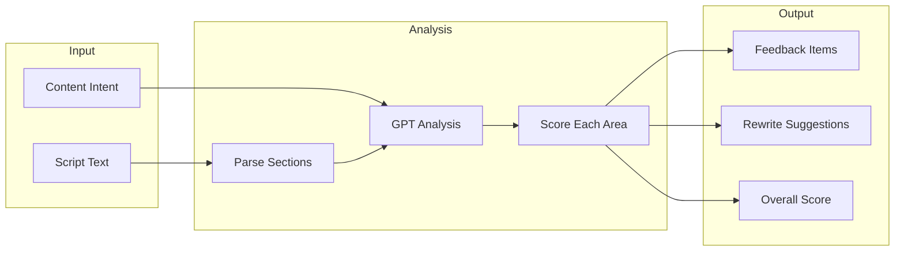

# Feature: Script Feedback

## Module
AI Assistant

## Overview
The Script Feedback feature uses AI to analyze user scripts and provide actionable suggestions to improve storytelling structure, engagement, and clarity. This helps content creators craft more effective narratives.

## User Stories

### US-SF-001: Get AI Feedback on Script
**As a** content creator  
**I want to** receive AI feedback on my script  
**So that** I can improve its structure and effectiveness

**Acceptance Criteria:**
- [ ] "Get Feedback" button in script editor
- [ ] AI analyzes hook, structure, CTA, conclusion
- [ ] Feedback displayed as actionable suggestions
- [ ] Can accept/dismiss individual suggestions

### US-SF-002: Apply AI Suggestions
**As a** content creator  
**I want to** apply AI suggestions with one click  
**So that** I can quickly improve my script

**Acceptance Criteria:**
- [ ] "Apply" button next to each suggestion
- [ ] Preview change before applying
- [ ] Undo support
- [ ] Track which suggestions were applied

### US-SF-003: Intent-Specific Feedback
**As a** content creator  
**I want** feedback tailored to my content intent  
**So that** suggestions match my goals

**Acceptance Criteria:**
- [ ] Educational: focus on clarity, learning progression
- [ ] Promotional: focus on benefits, urgency, CTA
- [ ] Storytelling: focus on narrative arc, emotion

## Feedback Categories

| Category | What It Analyzes | Example Feedback |
|----------|------------------|------------------|
| **Hook** | First 10% of script | "Add a question or surprising fact to grab attention" |
| **Structure** | Section organization | "Consider breaking this into 3 clear sections" |
| **Clarity** | Sentence complexity | "Simplify this sentence for better comprehension" |
| **Engagement** | Varied sentence length | "Add shorter punchy sentences for emphasis" |
| **CTA** | Call-to-action strength | "Make your call-to-action more specific and actionable" |
| **Conclusion** | Ending impact | "End with a memorable takeaway or next step" |

## Technical Specifications

### AI Analysis Pipeline



### API Endpoint

```typescript
// POST /api/ai/script-feedback
interface ScriptFeedbackRequest {
  script: string;
  intent: ContentIntent;
}

interface ScriptFeedbackResponse {
  overallScore: number; // 1-100
  categories: FeedbackCategory[];
  suggestions: Suggestion[];
}

interface FeedbackCategory {
  name: string;
  score: number; // 1-10
  summary: string;
}

interface Suggestion {
  id: string;
  category: string;
  severity: 'low' | 'medium' | 'high';
  issue: string;
  suggestion: string;
  originalText?: string;
  suggestedText?: string;
  position?: { start: number; end: number };
}
```

### OpenAI Prompt

```typescript
const feedbackPrompt = `
You are an expert content strategist analyzing a script for a visual presentation.

Script:
"""
${script}
"""

Content Intent: ${intent}

Analyze this script and provide feedback in the following JSON format:

{
  "overallScore": <1-100>,
  "categories": [
    {
      "name": "Hook",
      "score": <1-10>,
      "summary": "<brief assessment>"
    },
    {
      "name": "Structure",
      "score": <1-10>,
      "summary": "<brief assessment>"
    },
    {
      "name": "Clarity",
      "score": <1-10>,
      "summary": "<brief assessment>"
    },
    {
      "name": "Engagement",
      "score": <1-10>,
      "summary": "<brief assessment>"
    },
    {
      "name": "CTA",
      "score": <1-10>,
      "summary": "<brief assessment>"
    },
    {
      "name": "Conclusion",
      "score": <1-10>,
      "summary": "<brief assessment>"
    }
  ],
  "suggestions": [
    {
      "category": "<category name>",
      "severity": "low|medium|high",
      "issue": "<what's wrong>",
      "suggestion": "<how to fix>",
      "originalText": "<text to replace, if applicable>",
      "suggestedText": "<replacement text, if applicable>"
    }
  ]
}

Focus on actionable, specific suggestions. Limit to 5 most impactful suggestions.
Tailor feedback to the ${intent} intent.
`;

async function getScriptFeedback(script: string, intent: ContentIntent) {
  const response = await openai.chat.completions.create({
    model: 'gpt-4o',
    messages: [{ role: 'user', content: feedbackPrompt }],
    response_format: { type: 'json_object' },
  });
  
  return JSON.parse(response.choices[0].message.content);
}
```

## UI Components

### Feedback Panel

```
┌─────────────────────────────────────────────────────────────┐
│  Script Feedback                            Score: 72/100   │
├─────────────────────────────────────────────────────────────┤
│                                                             │
│  📊 Category Scores                                         │
│  ─────────────────                                          │
│  Hook:        ████████░░ 8/10                               │
│  Structure:   ██████░░░░ 6/10                               │
│  Clarity:     ███████░░░ 7/10                               │
│  Engagement:  ██████░░░░ 6/10                               │
│  CTA:         █████░░░░░ 5/10  ⚠️ Needs improvement         │
│  Conclusion:  ████████░░ 8/10                               │
│                                                             │
│  💡 Suggestions                                             │
│  ─────────────                                              │
│  ┌───────────────────────────────────────────────────────┐  │
│  │ 🟡 CTA - Medium Priority                              │  │
│  │ Issue: Call-to-action is vague                        │  │
│  │ Suggestion: Replace "Learn more" with a specific      │  │
│  │ action like "Download the free guide"                 │  │
│  │                                                       │  │
│  │ [View in Script] [Apply Suggestion] [Dismiss]         │  │
│  └───────────────────────────────────────────────────────┘  │
│                                                             │
│  ┌───────────────────────────────────────────────────────┐  │
│  │ 🟡 Structure - Medium Priority                        │  │
│  │ Issue: Long paragraphs may lose viewer attention      │  │
│  │ Suggestion: Break the second section into 2-3         │  │
│  │ shorter points                                        │  │
│  │                                                       │  │
│  │ [View in Script] [Apply Suggestion] [Dismiss]         │  │
│  └───────────────────────────────────────────────────────┘  │
│                                                             │
│  [Regenerate Feedback]                                      │
└─────────────────────────────────────────────────────────────┘
```

### Component Implementation

```typescript
interface FeedbackPanelProps {
  feedback: ScriptFeedbackResponse | null;
  isLoading: boolean;
  onApplySuggestion: (suggestion: Suggestion) => void;
  onDismissSuggestion: (suggestionId: string) => void;
  onRefresh: () => void;
}

const FeedbackPanel: React.FC<FeedbackPanelProps> = ({
  feedback,
  isLoading,
  onApplySuggestion,
  onDismissSuggestion,
  onRefresh,
}) => {
  if (isLoading) {
    return <FeedbackSkeleton />;
  }
  
  if (!feedback) {
    return (
      <EmptyState
        title="No feedback yet"
        description="Click 'Get Feedback' to analyze your script"
        action={<Button onClick={onRefresh}>Get Feedback</Button>}
      />
    );
  }
  
  return (
    <div className="space-y-6">
      <ScoreOverview score={feedback.overallScore} />
      <CategoryScores categories={feedback.categories} />
      <SuggestionList
        suggestions={feedback.suggestions}
        onApply={onApplySuggestion}
        onDismiss={onDismissSuggestion}
      />
    </div>
  );
};
```

## Cost Considerations

- **Per analysis**: ~$0.01-0.02 (GPT-4o, ~1-2K tokens)
- **Rate limiting**: Max 5 analyses per project per hour
- **Caching**: Cache feedback for 1 hour if script unchanged

## Dependencies
- OpenAI API (GPT-4o)
- Script Input component
- State management for suggestions

## Related Features
- [Script Input](../story-editor/script-input.md)
- [Visual Suggestions](./visual-suggestions.md)
