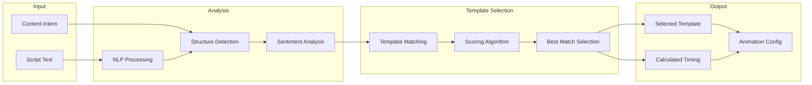

# Feature: Auto Animation

## Module
Animation Engine

## Overview
Auto Animation is the AI-powered system that automatically selects and applies appropriate animation templates to slides based on content analysis. This is a core differentiator that enables "motion design without motion designers."

## User Stories

### US-AA-001: Auto-Generate Slide Animations
**As a** content creator  
**I want** the system to automatically animate my slides  
**So that** I don't need animation expertise

**Acceptance Criteria:**
- [ ] Analyzes slide content (text, layout, element count)
- [ ] Selects appropriate template from library
- [ ] Applies animation with sensible timing
- [ ] Works for all slide types

### US-AA-002: Respect Content Intent
**As a** content creator  
**I want** animations to match my selected intent  
**So that** educational content feels different from promotional

**Acceptance Criteria:**
- [ ] Educational → Minimal, clear animations
- [ ] Promotional → Dynamic, attention-grabbing
- [ ] Storytelling → Cinematic, emotional

### US-AA-003: Smart Timing Calculation
**As a** content creator  
**I want** animation timing to match content length  
**So that** slides aren't too fast or slow

**Acceptance Criteria:**
- [ ] Duration based on text word count
- [ ] Minimum 3 seconds, maximum 30 seconds
- [ ] Allows manual override
- [ ] Syncs with voice-over when available

## Algorithm Design

### Content Analysis Pipeline

### Content Type Detection

> **Implementation**: See `src/types/animation.ts` for ContentAnalysis interface and ContentType union type (title-only, title-body, bullet-list, comparison, process-flow, feature-grid, quote, call-to-action)

### Template Matching Rules & Duration Calculation

> **Implementation**: See `src/services/animation/auto-animation.ts` for template matching rules, `selectTemplate` function, and `calculateDuration` function (word count based timing with voice-over sync support)

## Technical Specifications

### API Endpoint

> **Implementation**: See `src/types/animation.ts` for GenerateRequest, GenerateResponse, and GeneratedSlide interfaces

### AI Integration (OpenAI)

> **Implementation**: See `src/services/animation/auto-animation.ts` for the OpenAI content analysis prompt and integration logic

## Dependencies
- OpenAI API for content analysis
- Animation Templates library
- Voice Sync module (for timing)

## Related Features
- [Animation Templates](./animation-templates.md)
- [Script Feedback](../ai-assistant/script-feedback.md)
- [Audio Timeline Sync](../voice-sync/audio-timeline-sync.md)
