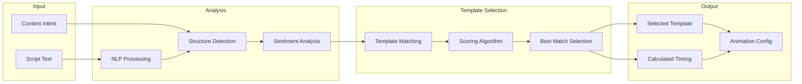

# Feature: Auto Animation

## Module
Animation Engine

## Overview
Auto Animation is the AI-powered system that automatically selects and applies appropriate animation templates to slides based on content analysis. This is a core differentiator that enables "motion design without motion designers."

## User Stories

### US-AA-001: Auto-Generate Slide Animations
**As a** content creator  
**I want** the system to automatically animate my slides  
**So that** I don't need animation expertise

**Acceptance Criteria:**
- [ ] Analyzes slide content (text, layout, element count)
- [ ] Selects appropriate template from library
- [ ] Applies animation with sensible timing
- [ ] Works for all slide types

### US-AA-002: Respect Content Intent
**As a** content creator  
**I want** animations to match my selected intent  
**So that** educational content feels different from promotional

**Acceptance Criteria:**
- [ ] Educational → Minimal, clear animations
- [ ] Promotional → Dynamic, attention-grabbing
- [ ] Storytelling → Cinematic, emotional

### US-AA-003: Smart Timing Calculation
**As a** content creator  
**I want** animation timing to match content length  
**So that** slides aren't too fast or slow

**Acceptance Criteria:**
- [ ] Duration based on text word count
- [ ] Minimum 3 seconds, maximum 30 seconds
- [ ] Allows manual override
- [ ] Syncs with voice-over when available

## Algorithm Design

### Content Analysis Pipeline



### Content Type Detection
```typescript
interface ContentAnalysis {
  type: ContentType;
  elementCount: number;
  wordCount: number;
  hasTitle: boolean;
  hasList: boolean;
  hasImage: boolean;
  sentiment: 'neutral' | 'positive' | 'urgent' | 'serious';
  complexity: 'simple' | 'moderate' | 'complex';
}

type ContentType = 
  | 'title-only'      // Single title/headline
  | 'title-body'      // Title + paragraph
  | 'bullet-list'     // List of points
  | 'comparison'      // Side-by-side elements
  | 'process-flow'    // Sequential steps
  | 'feature-grid'    // Multiple features
  | 'quote'           // Testimonial/quote
  | 'call-to-action'; // CTA slide
```

### Template Matching Rules
```typescript
const templateMatchingRules: MatchingRule[] = [
  {
    conditions: {
      contentType: 'title-only',
      intent: 'promotional',
    },
    templates: ['scale-pop', 'bounce-in'],
    weight: 1.0,
  },
  {
    conditions: {
      contentType: 'bullet-list',
      intent: 'educational',
    },
    templates: ['slide-up', 'stack-build'],
    weight: 0.9,
  },
  {
    conditions: {
      contentType: 'quote',
      intent: 'storytelling',
    },
    templates: ['typewriter', 'cinematic-fade'],
    weight: 1.0,
  },
  // ... more rules
];

function selectTemplate(analysis: ContentAnalysis, intent: ContentIntent): string {
  const matchedRules = templateMatchingRules.filter(rule =>
    matchesConditions(analysis, intent, rule.conditions)
  );
  
  // Score and rank templates
  const scored = matchedRules
    .flatMap(rule => rule.templates.map(t => ({ template: t, score: rule.weight })))
    .sort((a, b) => b.score - a.score);
  
  // Add some randomness for variety
  const topTemplates = scored.slice(0, 3);
  return weightedRandom(topTemplates);
}
```

### Duration Calculation
```typescript
function calculateDuration(
  slide: Slide,
  voiceOverDuration?: number
): number {
  // If voice-over exists, use that as primary guide
  if (voiceOverDuration) {
    return Math.max(voiceOverDuration, 3); // minimum 3s
  }
  
  // Calculate based on content
  const wordCount = countWords(slide);
  const elementCount = slide.elements.length;
  
  // Base: 150 words per minute reading speed
  const readingTime = (wordCount / 150) * 60;
  
  // Add time for element animations (0.5s per element)
  const animationTime = elementCount * 0.5;
  
  // Total with bounds
  const total = readingTime + animationTime;
  return Math.min(Math.max(total, 3), 30); // 3-30 seconds
}
```

## Technical Specifications

### API Endpoint
```typescript
// POST /api/projects/{id}/generate
interface GenerateRequest {
  script: string;
  intent: ContentIntent;
}

interface GenerateResponse {
  slides: GeneratedSlide[];
  totalDuration: number;
}

interface GeneratedSlide {
  id: string;
  content: string;
  elements: SlideElement[];
  template: string;
  duration: number;
  transition: TransitionType;
}
```

### AI Integration (OpenAI)
```typescript
const prompt = `
Analyze this script section and return JSON with:
- contentType: one of [title-only, title-body, bullet-list, comparison, process-flow, feature-grid, quote, call-to-action]
- elements: array of { type, content, role } for each visual element
- sentiment: one of [neutral, positive, urgent, serious]

Script section:
"""
${scriptSection}
"""

Intent: ${intent}
`;

const analysis = await openai.chat.completions.create({
  model: 'gpt-4o',
  messages: [{ role: 'user', content: prompt }],
  response_format: { type: 'json_object' },
});
```

## Dependencies
- OpenAI API for content analysis
- Animation Templates library
- Voice Sync module (for timing)

## Related Features
- [Animation Templates](./animation-templates.md)
- [Script Feedback](../ai-assistant/script-feedback.md)
- [Audio Timeline Sync](../voice-sync/audio-timeline-sync.md)
