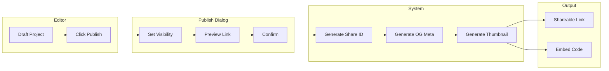

# Feature: Embed & Sharing

## Module
Export & Publish

## Overview
Embed & Sharing enables content creators to distribute their presentations through shareable links, embeddable iframes, and social media sharing. This module handles visibility settings, access control, and sharing analytics.

## User Stories

### US-ES-001: Publish Presentation
**As a** content creator  
**I want to** publish my presentation  
**So that** it becomes accessible via shareable link

**Acceptance Criteria:**
- [ ] Publish button in editor
- [ ] Confirmation dialog with visibility options
- [ ] Generates unique shareable URL
- [ ] Can unpublish at any time

### US-ES-002: Set Visibility Options
**As a** content creator  
**I want to** control who can view my presentation  
**So that** I can manage access

**Acceptance Criteria:**
- [ ] Public: Anyone can find and view
- [ ] Unlisted: Only accessible with direct link
- [ ] Password protected: Requires password
- [ ] Private: Only me (unpublished)

### US-ES-003: Share to Social Media
**As a** content creator  
**I want to** share my presentation on social media  
**So that** I can reach my audience

**Acceptance Criteria:**
- [ ] Share buttons: Twitter/X, LinkedIn, Facebook
- [ ] Pre-filled share text with link
- [ ] Open Graph meta tags for rich previews
- [ ] Custom thumbnail for social cards

### US-ES-004: Copy Embed Code
**As a** content creator  
**I want to** embed my presentation on external websites  
**So that** visitors can watch without leaving my site

**Acceptance Criteria:**
- [ ] Copy-to-clipboard embed code
- [ ] Customizable dimensions
- [ ] Responsive embed option
- [ ] Preview of embedded player

### US-ES-005: View Sharing Analytics (Phase 2)
**As a** content creator  
**I want to** see how many people viewed my presentation  
**So that** I can track engagement

**Acceptance Criteria:**
- [ ] View count
- [ ] Unique viewers
- [ ] Average watch time
- [ ] Geographic distribution

## Technical Specifications

### Publish Flow



### Share ID Generation

```typescript
import { customAlphabet } from 'nanoid';

// URL-safe, readable share IDs
const generateShareId = customAlphabet(
  '0123456789abcdefghijklmnopqrstuvwxyz',
  10
);

// Example: "a1b2c3d4e5"
```

### Visibility Settings

```typescript
interface PublishSettings {
  visibility: 'public' | 'unlisted' | 'password';
  password?: string; // hashed
  allowEmbed: boolean;
  allowDownload: boolean; // allow viewers to download video
  expiresAt?: Date; // optional link expiration
}

interface PublishedProject {
  projectId: string;
  shareId: string;
  settings: PublishSettings;
  publishedAt: Date;
  viewCount: number;
  thumbnailUrl: string;
  ogImageUrl: string;
}
```

### Open Graph Meta Tags

```typescript
// app/play/[id]/page.tsx
export async function generateMetadata({ params }: { params: { id: string } }) {
  const project = await getPublicProject(params.id);
  
  if (!project) return {};
  
  const ogImageUrl = `${process.env.NEXT_PUBLIC_APP_URL}/api/og/${params.id}`;
  
  return {
    title: project.name,
    description: `Watch "${project.name}" - Created with VisualStory`,
    openGraph: {
      title: project.name,
      description: `Watch "${project.name}" - Created with VisualStory`,
      type: 'video.other',
      url: `${process.env.NEXT_PUBLIC_APP_URL}/play/${params.id}`,
      images: [
        {
          url: ogImageUrl,
          width: 1200,
          height: 630,
          alt: project.name,
        },
      ],
    },
    twitter: {
      card: 'summary_large_image',
      title: project.name,
      description: `Watch "${project.name}" - Created with VisualStory`,
      images: [ogImageUrl],
    },
  };
}
```

### OG Image Generation

```typescript
// app/api/og/[id]/route.tsx
import { ImageResponse } from 'next/og';

export async function GET(req: Request, { params }: { params: { id: string } }) {
  const project = await getPublicProject(params.id);
  
  if (!project) {
    return new Response('Not found', { status: 404 });
  }
  
  return new ImageResponse(
    (
      <div
        style={{
          display: 'flex',
          flexDirection: 'column',
          alignItems: 'center',
          justifyContent: 'center',
          width: '100%',
          height: '100%',
          background: 'linear-gradient(135deg, #667eea 0%, #764ba2 100%)',
          padding: 40,
        }}
      >
        {/* Thumbnail preview */}
        
        
        {/* Title */}
        <h1 style={{ color: 'white', fontSize: 48, marginTop: 30 }}>
          {project.name}
        </h1>
        
        {/* Branding */}
        <div style={{ color: 'rgba(255,255,255,0.8)', fontSize: 24, marginTop: 10 }}>
          Created with VisualStory
        </div>
      </div>
    ),
    {
      width: 1200,
      height: 630,
    }
  );
}
```

### Social Share Functions

```typescript
interface ShareData {
  url: string;
  title: string;
  description?: string;
}

const shareUrls = {
  twitter: (data: ShareData) => 
    `https://twitter.com/intent/tweet?text=${encodeURIComponent(data.title)}&url=${encodeURIComponent(data.url)}`,
  
  linkedin: (data: ShareData) =>
    `https://www.linkedin.com/sharing/share-offsite/?url=${encodeURIComponent(data.url)}`,
  
  facebook: (data: ShareData) =>
    `https://www.facebook.com/sharer/sharer.php?u=${encodeURIComponent(data.url)}`,
};

function shareToSocial(platform: 'twitter' | 'linkedin' | 'facebook', data: ShareData) {
  const url = shareUrls[platform](data);
  window.open(url, '_blank', 'width=600,height=400');
}

// Native share API (mobile)
async function nativeShare(data: ShareData) {
  if (navigator.share) {
    await navigator.share({
      title: data.title,
      text: data.description,
      url: data.url,
    });
  }
}
```

### Password Protection

```typescript
// Middleware for password-protected presentations
export async function middleware(request: NextRequest) {
  const shareId = request.nextUrl.pathname.split('/').pop();
  const published = await getPublishedProject(shareId);
  
  if (!published) {
    return NextResponse.next();
  }
  
  if (published.settings.visibility === 'password') {
    // Check for password cookie
    const passwordCookie = request.cookies.get(`pw_${shareId}`);
    
    if (!passwordCookie) {
      // Redirect to password page
      return NextResponse.redirect(
        new URL(`/play/${shareId}/unlock`, request.url)
      );
    }
    
    // Verify password hash
    const isValid = await verifyPassword(
      passwordCookie.value,
      published.settings.password
    );
    
    if (!isValid) {
      return NextResponse.redirect(
        new URL(`/play/${shareId}/unlock`, request.url)
      );
    }
  }
  
  return NextResponse.next();
}
```

## UI Components

### Publish Dialog

```
┌─────────────────────────────────────────────────────────────┐
│  Publish "My Presentation"                             [X]  │
├─────────────────────────────────────────────────────────────┤
│                                                             │
│  Visibility                                                 │
│  ┌───────────────────────────────────────────────────────┐  │
│  │ ○ 🌍 Public                                           │  │
│  │   Anyone can find this in search and view it          │  │
│  ├───────────────────────────────────────────────────────┤  │
│  │ ● 🔗 Unlisted                                         │  │
│  │   Only people with the link can view                  │  │
│  ├───────────────────────────────────────────────────────┤  │
│  │ ○ 🔒 Password Protected                               │  │
│  │   Viewers need a password to access                   │  │
│  │   Password: [••••••••]                                │  │
│  └───────────────────────────────────────────────────────┘  │
│                                                             │
│  Options                                                    │
│  ☑ Allow embedding on external websites                     │
│  ☐ Allow viewers to download video                          │
│                                                             │
│  Preview Link                                               │
│  visualstory.app/play/a1b2c3d4e5                           │
│                                                             │
│              [Cancel]  [Publish]                            │
└─────────────────────────────────────────────────────────────┘
```

### Share Panel (After Publishing)

```
┌─────────────────────────────────────────────────────────────┐
│  Share                                                      │
├─────────────────────────────────────────────────────────────┤
│                                                             │
│  Link                                                       │
│  ┌───────────────────────────────────┬─────────┐           │
│  │ visualstory.app/play/a1b2c3d4e5   │ [Copy]  │           │
│  └───────────────────────────────────┴─────────┘           │
│                                                             │
│  Share on                                                   │
│  [🐦 Twitter]  [💼 LinkedIn]  [📘 Facebook]  [📤 More]      │
│                                                             │
│  Embed                                                      │
│  ┌───────────────────────────────────────────────────────┐  │
│  │ <iframe src="https://visualstory.app/embed/a1b2c...   │  │
│  └───────────────────────────────────────────────────────┘  │
│  [Copy Embed Code]                                          │
│                                                             │
│  ─────────────────────────────────────                      │
│  Views: 142  │  Status: 🟢 Published (Unlisted)            │
│  [Unpublish]  [Edit Settings]                               │
│                                                             │
└─────────────────────────────────────────────────────────────┘
```

## Database Schema

```typescript
// Prisma schema
model PublishedProject {
  id            String    @id @default(cuid())
  projectId     String    @unique
  project       Project   @relation(fields: [projectId], references: [id])
  shareId       String    @unique
  visibility    Visibility
  password      String?   // bcrypt hashed
  allowEmbed    Boolean   @default(true)
  allowDownload Boolean   @default(false)
  expiresAt     DateTime?
  publishedAt   DateTime  @default(now())
  viewCount     Int       @default(0)
  thumbnailUrl  String?
  ogImageUrl    String?
  
  views         ProjectView[]
}

enum Visibility {
  PUBLIC
  UNLISTED
  PASSWORD
}

model ProjectView {
  id              String    @id @default(cuid())
  publishedId     String
  published       PublishedProject @relation(fields: [publishedId], references: [id])
  viewedAt        DateTime  @default(now())
  watchDuration   Int?      // seconds
  country         String?
  referrer        String?
  userAgent       String?
}
```

## Dependencies
- nanoid for share ID generation
- next/og for OG image generation
- bcrypt for password hashing
- Cloudflare R2 for thumbnails

## Related Features
- [Web Player](./web-player.md)
- [Video Export](./video-export.md)
