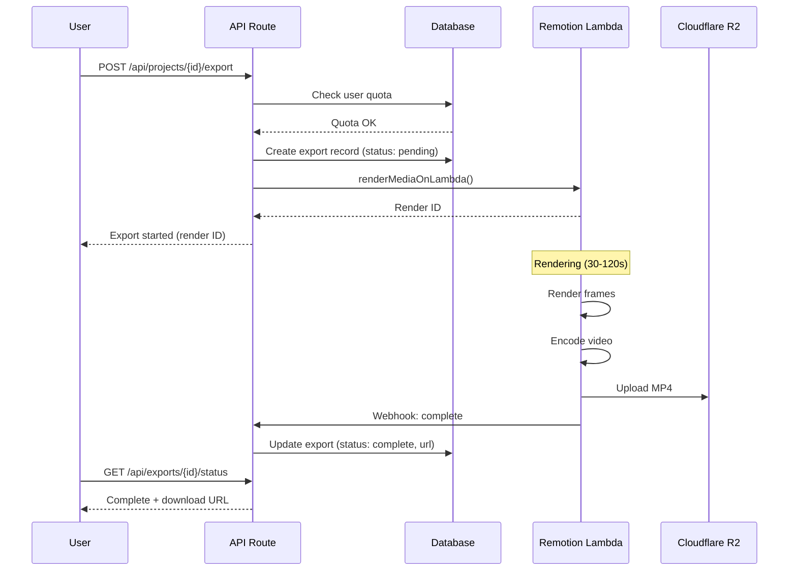

# Feature: Video Export

## Module
Export & Publish

## Overview
Video Export renders the presentation as an MP4 video file with synchronized animation and voice-over. This uses Remotion Lambda for serverless video rendering, enabling scalable production-quality exports.

## User Stories

### US-VE-001: Export Presentation as Video
**As a** content creator  
**I want to** export my presentation as an MP4 video  
**So that** I can share it on YouTube, social media, or embed it

**Acceptance Criteria:**
- [ ] One-click export button
- [ ] Progress indicator during rendering
- [ ] Download link when complete
- [ ] Email notification option for long renders

### US-VE-002: Select Video Quality
**As a** content creator  
**I want to** choose video resolution  
**So that** I can balance quality and file size

**Acceptance Criteria:**
- [ ] Options: 720p, 1080p (default), 4K (Pro tier)
- [ ] Estimated file size shown
- [ ] 4K restricted to paid plans
- [ ] Quality affects render time

### US-VE-003: Free Tier Watermark
**As a** free tier user  
**I understand** my exports will have a watermark  
**So that** I can upgrade for watermark-free exports

**Acceptance Criteria:**
- [ ] Subtle watermark in corner
- [ ] Watermark shows "Made with VisualStory"
- [ ] Upgrade prompt before export
- [ ] Watermark not on paid tier exports

### US-VE-004: Track Export Usage
**As a** free tier user  
**I want to** see my remaining exports  
**So that** I know when I need to upgrade

**Acceptance Criteria:**
- [ ] Counter shows X/Y exports used this month
- [ ] Warning at 80% usage
- [ ] Block with upgrade prompt at limit
- [ ] Counter resets monthly

## Technical Specifications

### Remotion Lambda Setup

```typescript
// remotion.config.ts
import { Config } from '@remotion/cli/config';

Config.setVideoImageFormat('jpeg');
Config.setOverwriteOutput(true);

// Lambda configuration
export const lambdaConfig = {
  region: 'us-east-1',
  functionName: 'visualstory-render',
  memorySizeInMb: 2048,
  timeoutInSeconds: 240,
  diskSizeInMb: 2048,
};
```

### Rendering Pipeline



### API Endpoints

```typescript
// POST /api/projects/{id}/export
interface ExportRequest {
  quality: '720p' | '1080p' | '4k';
  includeVoiceover: boolean;
}

interface ExportResponse {
  exportId: string;
  status: 'queued' | 'rendering' | 'complete' | 'failed';
  estimatedTime?: number; // seconds
}

// GET /api/exports/{id}/status
interface ExportStatusResponse {
  exportId: string;
  status: 'queued' | 'rendering' | 'complete' | 'failed';
  progress?: number; // 0-100
  downloadUrl?: string;
  expiresAt?: string; // ISO date
  error?: string;
}
```

### Export Handler

```typescript
import { renderMediaOnLambda, getRenderProgress } from '@remotion/lambda/client';

export async function POST(req: Request) {
  const { projectId } = req.params;
  const { quality, includeVoiceover } = await req.json();
  const user = await getAuthUser(req);
  
  // Check quota
  const quota = await checkExportQuota(user.id);
  if (!quota.allowed) {
    return Response.json({ error: 'Export limit reached' }, { status: 403 });
  }
  
  // Check quality permissions
  if (quality === '4k' && user.plan === 'free') {
    return Response.json({ error: '4K requires Pro plan' }, { status: 403 });
  }
  
  const project = await getProject(projectId);
  
  // Create export record
  const exportRecord = await createExport({
    projectId,
    userId: user.id,
    quality,
    status: 'queued',
  });
  
  // Trigger Lambda render
  const { renderId } = await renderMediaOnLambda({
    region: 'us-east-1',
    functionName: 'visualstory-render',
    composition: 'Presentation',
    inputProps: {
      project,
      includeVoiceover,
      watermark: user.plan === 'free',
    },
    codec: 'h264',
    imageFormat: 'jpeg',
    ...getQualityConfig(quality),
    outName: `${projectId}-${Date.now()}.mp4`,
    downloadBehavior: { type: 'download', fileName: `${project.name}.mp4` },
  });
  
  // Update record with render ID
  await updateExport(exportRecord.id, { renderId, status: 'rendering' });
  
  // Increment usage
  await incrementExportUsage(user.id);
  
  return Response.json({
    exportId: exportRecord.id,
    status: 'rendering',
    estimatedTime: estimateRenderTime(project, quality),
  });
}

function getQualityConfig(quality: string) {
  switch (quality) {
    case '720p':
      return { width: 1280, height: 720, crf: 23 };
    case '1080p':
      return { width: 1920, height: 1080, crf: 20 };
    case '4k':
      return { width: 3840, height: 2160, crf: 18 };
    default:
      return { width: 1920, height: 1080, crf: 20 };
  }
}
```

### Remotion Composition

```typescript
// remotion/compositions/Presentation.tsx
import { Composition, AbsoluteFill, Audio, Sequence } from 'remotion';

interface PresentationProps {
  project: Project;
  includeVoiceover: boolean;
  watermark: boolean;
}

export const Presentation: React.FC<PresentationProps> = ({
  project,
  includeVoiceover,
  watermark,
}) => {
  const { fps } = useVideoConfig();
  
  // Calculate total frames
  const totalFrames = project.slides.reduce(
    (acc, slide) => acc + (slide.duration * fps),
    0
  );
  
  let currentFrame = 0;
  
  return (
    <AbsoluteFill style={{ backgroundColor: '#ffffff' }}>
      {/* Slides */}
      {project.slides.map((slide, index) => {
        const startFrame = currentFrame;
        const durationFrames = slide.duration * fps;
        currentFrame += durationFrames;
        
        return (
          <Sequence
            key={slide.id}
            from={startFrame}
            durationInFrames={durationFrames}
          >
            <SlideComposition
              slide={slide}
              transition={slide.transition}
            />
          </Sequence>
        );
      })}
      
      {/* Voice-over audio */}
      {includeVoiceover && project.voiceConfig?.globalAudioUrl && (
        <Audio src={project.voiceConfig.globalAudioUrl} />
      )}
      
      {/* Watermark for free tier */}
      {watermark && <Watermark />}
    </AbsoluteFill>
  );
};

const Watermark: React.FC = () => (
  <div
    style={{
      position: 'absolute',
      bottom: 20,
      right: 20,
      opacity: 0.5,
      fontSize: 14,
      color: '#666',
      fontFamily: 'sans-serif',
    }}
  >
    Made with VisualStory
  </div>
);
```

### Progress Polling

```typescript
// Client-side progress polling
function useExportProgress(exportId: string) {
  const [status, setStatus] = useState<ExportStatusResponse | null>(null);
  
  useEffect(() => {
    if (!exportId) return;
    
    const pollInterval = setInterval(async () => {
      const response = await fetch(`/api/exports/${exportId}/status`);
      const data = await response.json();
      setStatus(data);
      
      if (data.status === 'complete' || data.status === 'failed') {
        clearInterval(pollInterval);
      }
    }, 3000); // Poll every 3 seconds
    
    return () => clearInterval(pollInterval);
  }, [exportId]);
  
  return status;
}
```

## UI Components

### Export Dialog

```
┌─────────────────────────────────────────────────────────────┐
│  Export Video                                          [X]  │
├─────────────────────────────────────────────────────────────┤
│                                                             │
│  Quality                                                    │
│  ○ 720p (HD) - ~50MB, fastest                              │
│  ● 1080p (Full HD) - ~100MB, recommended                   │
│  ○ 4K (Ultra HD) - ~300MB, Pro only 🔒                     │
│                                                             │
│  Options                                                    │
│  ☑ Include voice-over                                       │
│  ☐ Email me when ready                                      │
│                                                             │
│  ─────────────────────────────────────                      │
│  Estimated render time: ~45 seconds                         │
│  Your exports this month: 3/5                               │
│                                                             │
│  ⚠️ Free tier exports include watermark                     │
│  [Upgrade to Pro for watermark-free exports]                │
│                                                             │
│              [Cancel]  [Export Video]                       │
└─────────────────────────────────────────────────────────────┘
```

### Export Progress

```
┌─────────────────────────────────────────────────────────────┐
│  Exporting...                                               │
├─────────────────────────────────────────────────────────────┤
│                                                             │
│  ████████████████████░░░░░░░░░░░░░░░░░░░░  47%             │
│                                                             │
│  Rendering slide 6 of 12...                                 │
│  Estimated time remaining: 25 seconds                       │
│                                                             │
│  💡 Tip: You can close this dialog - we'll notify you       │
│     when your video is ready.                               │
│                                                             │
│              [Cancel Export]                                │
└─────────────────────────────────────────────────────────────┘
```

## Cost Analysis

| Resolution | Lambda Duration | Lambda Cost | R2 Storage (30 days) | Total/Export |
|------------|----------------|-------------|----------------------|--------------|
| 720p | ~30s | $0.03 | $0.001 | ~$0.03 |
| 1080p | ~60s | $0.06 | $0.002 | ~$0.06 |
| 4K | ~120s | $0.12 | $0.006 | ~$0.13 |

**At 200 exports/day (1080p)**: ~$12/day = ~$360/month

## Dependencies
- Remotion + Remotion Lambda
- Cloudflare R2 for video storage
- Database for export tracking
- Stripe for quota enforcement

## Related Features
- [Web Player](./web-player.md)
- [Subscription Billing](../user-management/subscription-billing.md)
