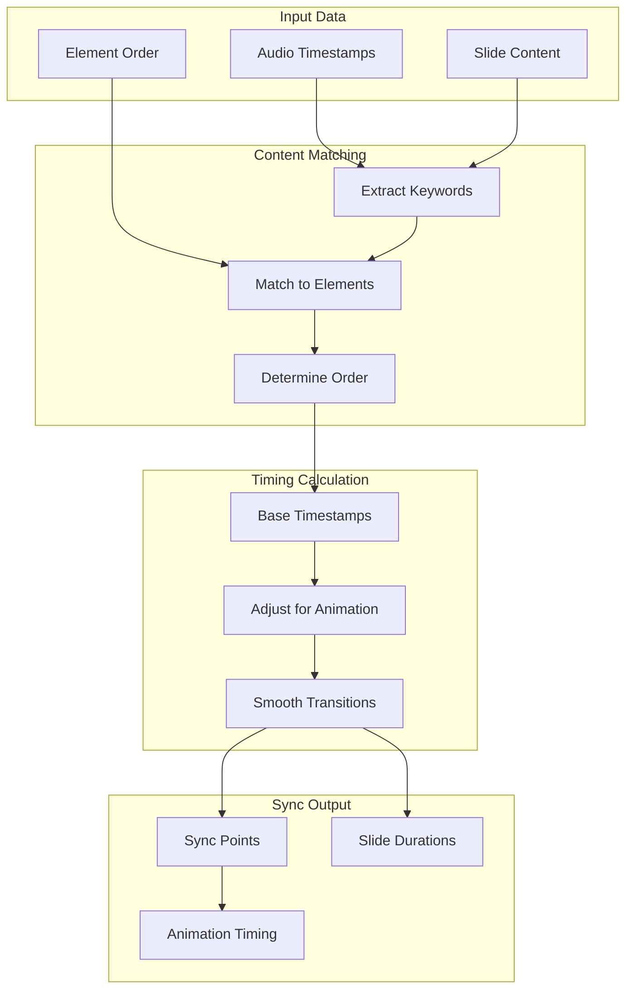

# Feature: Audio Timeline Sync

## Module
Voice Sync

## Overview
Audio Timeline Sync is the core technology that automatically synchronizes voice-over audio with slide animations. This is a key differentiator that eliminates the tedious manual timing work typically required in video production.

## User Stories

### US-ATS-001: Auto-Sync Voice to Animation
**As a** content creator  
**I want** my voice-over to automatically sync with slide animations  
**So that** elements appear as they're being spoken about

**Acceptance Criteria:**
- [ ] Animations trigger based on audio timestamps
- [ ] Smooth timing without jarring cuts
- [ ] Works with AI-generated and uploaded audio
- [ ] Sync adjusts when audio is regenerated

### US-ATS-002: Visual Sync Timeline
**As a** content creator  
**I want to** see a visual representation of audio-to-slide sync  
**So that** I can verify the timing is correct

**Acceptance Criteria:**
- [ ] Waveform display under timeline
- [ ] Markers showing slide boundaries
- [ ] Highlighted current word during playback
- [ ] Visual indicator of sync points

### US-ATS-003: Manual Timing Adjustment
**As a** content creator  
**I want to** manually adjust sync timing  
**So that** I can fine-tune when elements appear

**Acceptance Criteria:**
- [ ] Drag sync points to adjust
- [ ] Input specific timestamp
- [ ] Preview changes immediately
- [ ] Reset to auto-calculated timing

### US-ATS-004: Slide Duration Auto-Adjust
**As a** content creator  
**I want** slide durations to automatically match voice-over length  
**So that** slides don't end before narration finishes

**Acceptance Criteria:**
- [ ] Slide extends to match audio
- [ ] Minimum padding after last word (0.5s)
- [ ] Can override auto-duration
- [ ] Handles variable-length audio

## Sync Algorithm

### Sync Point Calculation



### Core Sync Logic

```typescript
interface SyncPoint {
  elementId: string;
  triggerTime: number; // milliseconds from slide start
  wordIndex: number; // which word triggers this element
}

interface SlideSync {
  slideId: string;
  startTime: number; // global timeline position
  duration: number;
  syncPoints: SyncPoint[];
}

function calculateSync(
  slide: Slide,
  audioTimestamps: WordTimestamp[]
): SlideSync {
  const syncPoints: SyncPoint[] = [];
  
  // Get ordered elements (title first, then body, etc.)
  const orderedElements = orderElementsByPriority(slide.elements);
  
  // Extract key phrases from each element
  const elementPhrases = orderedElements.map(el => ({
    element: el,
    keywords: extractKeywords(el.content),
  }));
  
  // Match keywords to audio timestamps
  let lastMatchedIndex = 0;
  
  for (const { element, keywords } of elementPhrases) {
    // Find when this element's content is spoken
    const matchIndex = findKeywordInTimestamps(
      keywords,
      audioTimestamps,
      lastMatchedIndex
    );
    
    if (matchIndex !== -1) {
      // Trigger element slightly BEFORE word is spoken (anticipation)
      const triggerTime = Math.max(0, audioTimestamps[matchIndex].startTime - 200);
      
      syncPoints.push({
        elementId: element.id,
        triggerTime,
        wordIndex: matchIndex,
      });
      
      lastMatchedIndex = matchIndex;
    } else {
      // Fallback: stagger elements evenly
      const staggerTime = lastMatchedIndex * 500 + syncPoints.length * 300;
      syncPoints.push({
        elementId: element.id,
        triggerTime: staggerTime,
        wordIndex: -1, // no match
      });
    }
  }
  
  // Calculate slide duration (last timestamp + padding)
  const lastTimestamp = audioTimestamps[audioTimestamps.length - 1];
  const duration = lastTimestamp.endTime + 500; // 0.5s padding
  
  return {
    slideId: slide.id,
    startTime: 0, // set by timeline
    duration,
    syncPoints,
  };
}

function findKeywordInTimestamps(
  keywords: string[],
  timestamps: WordTimestamp[],
  startIndex: number
): number {
  for (let i = startIndex; i < timestamps.length; i++) {
    const word = timestamps[i].word.toLowerCase();
    if (keywords.some(kw => word.includes(kw.toLowerCase()))) {
      return i;
    }
  }
  return -1;
}
```

### Remotion Integration

```typescript
// Synced slide component
const SyncedSlide: React.FC<{
  slide: Slide;
  sync: SlideSync;
  audioUrl: string;
}> = ({ slide, sync, audioUrl }) => {
  const frame = useCurrentFrame();
  const { fps } = useVideoConfig();
  
  // Convert frame to milliseconds
  const currentTimeMs = (frame / fps) * 1000;
  
  return (
    <AbsoluteFill>
      {/* Audio layer */}
      <Audio src={audioUrl} />
      
      {/* Elements with sync-based animation */}
      {slide.elements.map(element => {
        const syncPoint = sync.syncPoints.find(sp => sp.elementId === element.id);
        const triggerFrame = syncPoint 
          ? (syncPoint.triggerTime / 1000) * fps
          : 0;
        
        // Element is visible after trigger
        const progress = interpolate(
          frame,
          [triggerFrame, triggerFrame + 15], // 0.5s animation
          [0, 1],
          { extrapolateLeft: 'clamp', extrapolateRight: 'clamp' }
        );
        
        return (
          <AnimatedElement
            key={element.id}
            element={element}
            progress={progress}
          />
        );
      })}
    </AbsoluteFill>
  );
};
```

## UI Components

### Sync Timeline Visualization

```
┌─────────────────────────────────────────────────────────────────────────┐
│  Audio Sync Timeline                                                    │
├─────────────────────────────────────────────────────────────────────────┤
│                                                                         │
│  Waveform: ▁▂▃▅▇▅▃▂▁▂▃▅▇▅▃▂▁▁▂▃▅▇▅▃▂▁▂▃▅▇▅▃▂▁                          │
│            │    │         │              │                              │
│            ▼    ▼         ▼              ▼                              │
│  Elements: [Title]  [Bullet 1]  [Bullet 2]  [Bullet 3]                 │
│                                                                         │
│  Sync Points: ●────────●──────────●──────────────●                      │
│               0:00     0:02       0:05           0:08                   │
│                                                                         │
│  ──────────────────────●──────────────────────────────                  │
│                      0:04.2                                             │
└─────────────────────────────────────────────────────────────────────────┘
```

### Sync Point Editor

```typescript
interface SyncPointEditorProps {
  slideId: string;
  syncPoints: SyncPoint[];
  audioUrl: string;
  onSyncPointChange: (elementId: string, newTime: number) => void;
}

const SyncPointEditor: React.FC<SyncPointEditorProps> = ({
  slideId,
  syncPoints,
  audioUrl,
  onSyncPointChange,
}) => {
  const [waveformData, setWaveformData] = useState<number[]>([]);
  
  useEffect(() => {
    // Generate waveform visualization
    generateWaveform(audioUrl).then(setWaveformData);
  }, [audioUrl]);
  
  return (
    <div className="sync-editor">
      <WaveformDisplay data={waveformData} />
      <SyncPointMarkers
        points={syncPoints}
        onDrag={(elementId, newTime) => onSyncPointChange(elementId, newTime)}
      />
      <PlaybackScrubber audioUrl={audioUrl} />
    </div>
  );
};
```

## Data Model

```typescript
interface VoiceConfig {
  id: string;
  projectId: string;
  voiceId: string;
  globalAudioUrl?: string; // combined audio for full presentation
  slideConfigs: SlideVoiceConfig[];
}

interface SlideVoiceConfig {
  slideId: string;
  audioUrl: string;
  duration: number;
  timestamps: WordTimestamp[];
  syncPoints: SyncPoint[];
  manualAdjustments: SyncAdjustment[];
}

interface SyncAdjustment {
  elementId: string;
  originalTime: number;
  adjustedTime: number;
  adjustedBy: 'user' | 'auto';
}
```

## Dependencies
- Text-to-Speech module for audio + timestamps
- Remotion for synced playback
- Web Audio API for waveform generation

## Related Features
- [Text-to-Speech](./text-to-speech.md)
- [Timeline View](../story-editor/timeline-view.md)
- [Video Export](../export-publish/video-export.md)
