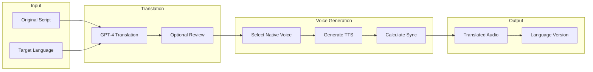

# Feature: Multi-Language Voice-Over

## Module
Voice Sync

## Overview
Multi-language support enables content creators to generate voice-overs in multiple languages from a single script. This feature is planned for Phase 2 and will leverage AI translation combined with multilingual TTS.

## Status
**Phase 2** - Not included in MVP

## User Stories

### US-ML-001: Generate Voice in Different Language
**As a** content creator  
**I want to** generate voice-over in a different language  
**So that** I can reach international audiences

**Acceptance Criteria:**
- [ ] Language selector with 10+ languages
- [ ] AI translates script maintaining meaning
- [ ] Native-sounding voice in target language
- [ ] Preserves timing and sync points

### US-ML-002: Maintain Multiple Language Versions
**As a** content creator  
**I want to** keep multiple language versions of my project  
**So that** I can export videos for different markets

**Acceptance Criteria:**
- [ ] Switch between language versions
- [ ] Each version has own audio + sync
- [ ] Visual content remains the same
- [ ] Export any language version

### US-ML-003: Review and Edit Translations
**As a** content creator  
**I want to** review and edit AI translations  
**So that** I can ensure accuracy

**Acceptance Criteria:**
- [ ] Side-by-side original and translation
- [ ] Edit translation text
- [ ] Regenerate audio after edits
- [ ] Flag for human review option

## Supported Languages (Phase 2 Target)

| Language | Code | ElevenLabs Support | Priority |
|----------|------|-------------------|----------|
| English | en | Native | MVP |
| Spanish | es | Native | High |
| French | fr | Native | High |
| German | de | Native | High |
| Portuguese | pt | Native | Medium |
| Italian | it | Native | Medium |
| Japanese | ja | Native | Medium |
| Korean | ko | Native | Medium |
| Chinese (Mandarin) | zh | Native | Medium |
| Hindi | hi | Supported | Low |

## Technical Approach

### Translation Pipeline



### Translation with Context Preservation

```typescript
interface TranslationRequest {
  text: string;
  sourceLanguage: string;
  targetLanguage: string;
  context: {
    intent: ContentIntent;
    slideNumber: number;
    totalSlides: number;
  };
}

async function translateScript(request: TranslationRequest): Promise<string> {
  const prompt = `
Translate the following text from ${request.sourceLanguage} to ${request.targetLanguage}.

Context:
- This is slide ${request.slideNumber} of ${request.totalSlides}
- Content intent: ${request.context.intent}

Requirements:
- Maintain the same tone and emotion
- Keep technical terms consistent
- Preserve emphasis markers (**, __)
- Keep the translation concise (similar word count)

Original text:
"""
${request.text}
"""

Translated text:`;

  const response = await openai.chat.completions.create({
    model: 'gpt-4o',
    messages: [{ role: 'user', content: prompt }],
  });
  
  return response.choices[0].message.content;
}
```

### Multi-Language Data Model

```typescript
interface LanguageVersion {
  id: string;
  projectId: string;
  languageCode: string;
  isOriginal: boolean;
  
  // Translated content
  slides: {
    slideId: string;
    translatedContent: string;
    audioUrl?: string;
    syncPoints?: SyncPoint[];
  }[];
  
  // Metadata
  translatedAt: Date;
  translatedBy: 'ai' | 'human';
  reviewedAt?: Date;
  reviewedBy?: string;
}

// Project with language versions
interface Project {
  // ... existing fields
  
  defaultLanguage: string;
  languageVersions: LanguageVersion[];
}
```

### Voice Selection per Language

```typescript
const languageVoices: Record<string, VoiceOption[]> = {
  en: [
    { id: 'adam', name: 'Adam', gender: 'male' },
    { id: 'rachel', name: 'Rachel', gender: 'female' },
  ],
  es: [
    { id: 'carlos', name: 'Carlos', gender: 'male' },
    { id: 'sofia', name: 'Sofia', gender: 'female' },
  ],
  fr: [
    { id: 'pierre', name: 'Pierre', gender: 'male' },
    { id: 'marie', name: 'Marie', gender: 'female' },
  ],
  // ... more languages
};
```

## UI Design (Phase 2)

### Language Version Selector

```
┌─────────────────────────────────────────────────────────────┐
│  Language Versions                                          │
├─────────────────────────────────────────────────────────────┤
│                                                             │
│  [🇺🇸 English (Original)] ✓                                 │
│  [🇪🇸 Spanish] ✓  Audio generated                           │
│  [🇫🇷 French] ○  Click to generate                          │
│  [+ Add Language]                                           │
│                                                             │
│  ─────────────────────────────────────────                  │
│                                                             │
│  Current: Spanish                                           │
│  Voice: Sofia (Female)  [Change]                            │
│                                                             │
│  [Preview Spanish] [Export Spanish Video]                   │
│                                                             │
└─────────────────────────────────────────────────────────────┘
```

## Cost Considerations

- **Translation**: ~$0.002 per 1K characters (GPT-4o)
- **TTS**: Same as single-language (per character)
- **Total per additional language**: ~$0.30-0.50 per video

## Dependencies
- OpenAI API for translation
- ElevenLabs multilingual voices
- Text-to-Speech module
- Audio Timeline Sync

## Phase 2 Implementation Notes

1. Start with 5 high-demand languages
2. Allow user-submitted translations for accuracy
3. Cache common phrase translations
4. Consider community translation marketplace

## Related Features
- [Text-to-Speech](./text-to-speech.md)
- [Audio Timeline Sync](./audio-timeline-sync.md)
