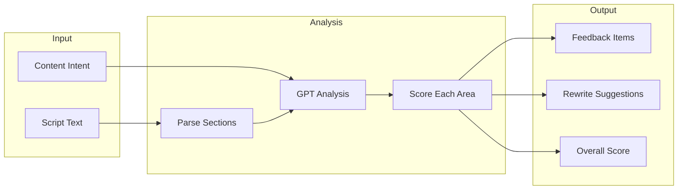

# Feature: Script Feedback

## Module
AI Assistant

## Overview
The Script Feedback feature uses AI to analyze user scripts and provide actionable suggestions to improve storytelling structure, engagement, and clarity. This helps content creators craft more effective narratives.

## User Stories

### US-SF-001: Get AI Feedback on Script
**As a** content creator  
**I want to** receive AI feedback on my script  
**So that** I can improve its structure and effectiveness

**Acceptance Criteria:**
- [ ] "Get Feedback" button in script editor
- [ ] AI analyzes hook, structure, CTA, conclusion
- [ ] Feedback displayed as actionable suggestions
- [ ] Can accept/dismiss individual suggestions

### US-SF-002: Apply AI Suggestions
**As a** content creator  
**I want to** apply AI suggestions with one click  
**So that** I can quickly improve my script

**Acceptance Criteria:**
- [ ] "Apply" button next to each suggestion
- [ ] Preview change before applying
- [ ] Undo support
- [ ] Track which suggestions were applied

### US-SF-003: Intent-Specific Feedback
**As a** content creator  
**I want** feedback tailored to my content intent  
**So that** suggestions match my goals

**Acceptance Criteria:**
- [ ] Educational: focus on clarity, learning progression
- [ ] Promotional: focus on benefits, urgency, CTA
- [ ] Storytelling: focus on narrative arc, emotion

## Feedback Categories

| Category | What It Analyzes | Example Feedback |
|----------|------------------|------------------|
| **Hook** | First 10% of script | "Add a question or surprising fact to grab attention" |
| **Structure** | Section organization | "Consider breaking this into 3 clear sections" |
| **Clarity** | Sentence complexity | "Simplify this sentence for better comprehension" |
| **Engagement** | Varied sentence length | "Add shorter punchy sentences for emphasis" |
| **CTA** | Call-to-action strength | "Make your call-to-action more specific and actionable" |
| **Conclusion** | Ending impact | "End with a memorable takeaway or next step" |

## Technical Specifications

### AI Analysis Pipeline



### API Endpoint

> **Implementation**: See `src/types/ai.ts` for API interfaces (ScriptFeedbackRequest, ScriptFeedbackResponse, FeedbackCategory, Suggestion)

### OpenAI Prompt & Feedback Logic

> **Implementation**: See `src/lib/ai/script-feedback.ts` for the OpenAI prompt template and `getScriptFeedback` function

## UI Components

### Feedback Panel

```
┌─────────────────────────────────────────────────────────────┐
│  Script Feedback                            Score: 72/100   │
├─────────────────────────────────────────────────────────────┤
│                                                             │
│  📊 Category Scores                                         │
│  ─────────────────                                          │
│  Hook:        ████████░░ 8/10                               │
│  Structure:   ██████░░░░ 6/10                               │
│  Clarity:     ███████░░░ 7/10                               │
│  Engagement:  ██████░░░░ 6/10                               │
│  CTA:         █████░░░░░ 5/10  ⚠️ Needs improvement         │
│  Conclusion:  ████████░░ 8/10                               │
│                                                             │
│  💡 Suggestions                                             │
│  ─────────────                                              │
│  ┌───────────────────────────────────────────────────────┐  │
│  │ 🟡 CTA - Medium Priority                              │  │
│  │ Issue: Call-to-action is vague                        │  │
│  │ Suggestion: Replace "Learn more" with a specific      │  │
│  │ action like "Download the free guide"                 │  │
│  │                                                       │  │
│  │ [View in Script] [Apply Suggestion] [Dismiss]         │  │
│  └───────────────────────────────────────────────────────┘  │
│                                                             │
│  ┌───────────────────────────────────────────────────────┐  │
│  │ 🟡 Structure - Medium Priority                        │  │
│  │ Issue: Long paragraphs may lose viewer attention      │  │
│  │ Suggestion: Break the second section into 2-3         │  │
│  │ shorter points                                        │  │
│  │                                                       │  │
│  │ [View in Script] [Apply Suggestion] [Dismiss]         │  │
│  └───────────────────────────────────────────────────────┘  │
│                                                             │
│  [Regenerate Feedback]                                      │
└─────────────────────────────────────────────────────────────┘
```

### Component Implementation

> **Implementation**: See `src/components/ai/feedback-panel.tsx` for the FeedbackPanel component (FeedbackPanelProps, ScoreOverview, CategoryScores, SuggestionList)

## Cost Considerations

- **Per analysis**: ~$0.01-0.02 (GPT-4o, ~1-2K tokens)
- **Rate limiting**: Max 5 analyses per project per hour
- **Caching**: Cache feedback for 1 hour if script unchanged

## Dependencies
- OpenAI API (GPT-4o)
- Script Input component
- State management for suggestions

## Related Features
- [Script Input](../story-editor/script-input.md)
- [Visual Suggestions](./visual-suggestions.md)
