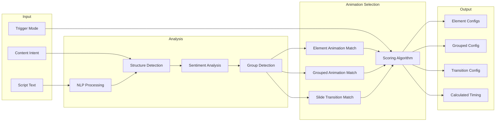

# Feature: Auto Animation

## Module
Animation Engine

## Overview
Auto Animation is the AI-powered system that automatically selects and applies appropriate animations to slides based on content analysis. It operates across all three animation layers — element animations, grouped animations, and slide transitions — and respects the presentation's trigger mode setting.

This is a core differentiator that enables **"motion design without motion designers."**

## User Stories

### US-AA-001: Auto-Generate Slide Animations
**As a** content creator
**I want** the system to automatically animate my slides
**So that** I don't need animation expertise

**Acceptance Criteria:**
- [ ] Analyzes slide content (text, layout, element count)
- [ ] Selects appropriate element animation from the [10 available](./element-animations/)
- [ ] Selects appropriate grouped animation from the [10 available](./grouped-animations/) when slide has 3+ related items
- [ ] Selects appropriate slide transition from the [5 available](./slide-transitions/)
- [ ] Applies animations with sensible timing
- [ ] Works for all slide types

### US-AA-002: Respect Content Intent
**As a** content creator
**I want** animations to match my selected intent
**So that** educational content feels different from promotional

**Acceptance Criteria:**
- [ ] Educational → Minimal, clear animations (Smooth Fade, Float In, List Accumulator)
- [ ] Promotional → Dynamic, attention-grabbing (Pop Zoom, Fan-Out, Zoom Focus)
- [ ] Storytelling → Cinematic, emotional (Masked Reveal, Infinite Path, Pan)

### US-AA-003: Smart Timing Calculation
**As a** content creator
**I want** animation timing to match content length
**So that** slides aren't too fast or slow

**Acceptance Criteria:**
- [ ] Duration based on text word count
- [ ] Minimum 3 seconds, maximum 30 seconds
- [ ] Allows manual override
- [ ] Syncs with voice-over when available
- [ ] In click mode: timing hints displayed but user advances manually

### US-AA-004: Trigger-Mode-Aware Selection
**As a** content creator
**I want** auto-selected animations to work well in my chosen trigger mode
**So that** the deck works for both self-running videos and live presentations

**Acceptance Criteria:**
- [ ] In auto mode: all timing calculated automatically
- [ ] In click mode: animations designed for good "click-step" granularity
- [ ] Grouped animations get appropriate `stepDuration` for auto mode
- [ ] Grouped animations get hover-preview enabled for click mode

## Algorithm Design

### Content Analysis Pipeline



### Content Type Detection

> **Implementation**: See `src/types/animation.ts` for ContentAnalysis interface and ContentType union type (title-only, title-body, bullet-list, comparison, process-flow, feature-grid, quote, call-to-action)

### Group Detection Logic

When a slide contains 3+ items that share a common structure (e.g., icon + title + description repeated), the auto-animation engine detects this as a **group candidate** and selects from the 10 grouped animation templates.

| Detected Pattern | Recommended Grouped Animation |
|-----------------|-------------------------------|
| Sequential list (1, 2, 3...) | List Accumulator, Infinite Path |
| Feature grid (equal items) | Bento Grid Expansion, Carousel Focus |
| Central concept + related items | Circular Satellite, Molecular Bond |
| Comparison set | Perspective Pivot, Bento Grid Expansion |
| Progressive reveal | Stack Reveal, Fan-Out |
| Overview + details | Magnifying Glass |

### Template Matching Rules

> **Implementation**: See `src/services/animation/auto-animation.ts` for template matching rules, `selectTemplate` function, and `calculateDuration` function

### Duration Calculation

| Content Type | Base Duration | Word Factor | Min | Max |
|-------------|---------------|-------------|-----|-----|
| Title only | 3000ms | +100ms/word | 3s | 8s |
| Title + body | 5000ms | +80ms/word | 5s | 15s |
| Bullet list | 4000ms | +120ms/word | 4s | 20s |
| Feature grid | 6000ms | +60ms/word | 6s | 25s |
| Quote | 4000ms | +100ms/word | 4s | 12s |

For **grouped animations**, step duration is calculated as:
```
stepDuration = totalSlideDuration / itemCount
```
With a minimum of 1200ms and maximum of 3000ms per step.

## Technical Specifications

### API Endpoint

> **Implementation**: See `src/types/animation.ts` for GenerateRequest, GenerateResponse, and GeneratedSlide interfaces

### AI Integration (OpenAI)

> **Implementation**: See `src/services/animation/auto-animation.ts` for the OpenAI content analysis prompt and integration logic

## Dependencies
- OpenAI API for content analysis
- [Element Animation library](./element-animations/)
- [Grouped Animation library](./grouped-animations/)
- [Slide Transition library](./slide-transitions/)
- [Voice Sync module](../voice-sync/audio-timeline-sync.md) (for timing)

## Related Features
- [Animation Engine Overview](./README.md)
- [Full Catalog](./catalog.md)
- [Script Feedback](../ai-assistant/script-feedback.md)
- [Audio Timeline Sync](../voice-sync/audio-timeline-sync.md)
