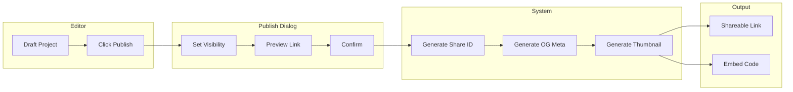

# Feature: Embed & Sharing

## Module
Export & Publish

## Overview
Embed & Sharing enables content creators to distribute their presentations through shareable links, embeddable iframes, and social media sharing. This module handles visibility settings, access control, and sharing analytics.

## User Stories

### US-ES-001: Publish Presentation
**As a** content creator  
**I want to** publish my presentation  
**So that** it becomes accessible via shareable link

**Acceptance Criteria:**
- [ ] Publish button in editor
- [ ] Confirmation dialog with visibility options
- [ ] Generates unique shareable URL
- [ ] Can unpublish at any time

### US-ES-002: Set Visibility Options
**As a** content creator  
**I want to** control who can view my presentation  
**So that** I can manage access

**Acceptance Criteria:**
- [ ] Public: Anyone can find and view
- [ ] Unlisted: Only accessible with direct link
- [ ] Password protected: Requires password
- [ ] Private: Only me (unpublished)

### US-ES-003: Share to Social Media
**As a** content creator  
**I want to** share my presentation on social media  
**So that** I can reach my audience

**Acceptance Criteria:**
- [ ] Share buttons: Twitter/X, LinkedIn, Facebook
- [ ] Pre-filled share text with link
- [ ] Open Graph meta tags for rich previews
- [ ] Custom thumbnail for social cards

### US-ES-004: Copy Embed Code
**As a** content creator  
**I want to** embed my presentation on external websites  
**So that** visitors can watch without leaving my site

**Acceptance Criteria:**
- [ ] Copy-to-clipboard embed code
- [ ] Customizable dimensions
- [ ] Responsive embed option
- [ ] Preview of embedded player

### US-ES-005: View Sharing Analytics (Phase 2)
**As a** content creator  
**I want to** see how many people viewed my presentation  
**So that** I can track engagement

**Acceptance Criteria:**
- [ ] View count
- [ ] Unique viewers
- [ ] Average watch time
- [ ] Geographic distribution

## Technical Specifications

### Publish Flow



### Share ID Generation, Visibility Settings & Publish Data

> **Implementation**: See `src/lib/sharing/share-id.ts` for nanoid-based share ID generation, and `src/types/sharing.ts` for PublishSettings and PublishedProject interfaces

### Open Graph Meta Tags

> **Implementation**: See `src/app/[locale]/play/[shareId]/page.tsx` for `generateMetadata` with OG tags (TODO)

### OG Image Generation

> **Implementation**: See `src/app/api/og/[id]/route.tsx` for dynamic OG image generation using `next/og` ImageResponse

### Social Share Functions

> **Implementation**: See `src/lib/sharing/social.ts` for social share URL builders (Twitter, LinkedIn, Facebook) and native share API support

### Password Protection

> **Implementation**: See `src/middleware.ts` for password-protected presentation middleware (TODO)

## UI Components

### Publish Dialog

```
┌─────────────────────────────────────────────────────────────┐
│  Publish "My Presentation"                             [X]  │
├─────────────────────────────────────────────────────────────┤
│                                                             │
│  Visibility                                                 │
│  ┌───────────────────────────────────────────────────────┐  │
│  │ ○ 🌍 Public                                           │  │
│  │   Anyone can find this in search and view it          │  │
│  ├───────────────────────────────────────────────────────┤  │
│  │ ● 🔗 Unlisted                                         │  │
│  │   Only people with the link can view                  │  │
│  ├───────────────────────────────────────────────────────┤  │
│  │ ○ 🔒 Password Protected                               │  │
│  │   Viewers need a password to access                   │  │
│  │   Password: [••••••••]                                │  │
│  └───────────────────────────────────────────────────────┘  │
│                                                             │
│  Options                                                    │
│  ☑ Allow embedding on external websites                     │
│  ☐ Allow viewers to download video                          │
│                                                             │
│  Preview Link                                               │
│  visualstory.app/play/a1b2c3d4e5                           │
│                                                             │
│              [Cancel]  [Publish]                            │
└─────────────────────────────────────────────────────────────┘
```

### Share Panel (After Publishing)

```
┌─────────────────────────────────────────────────────────────┐
│  Share                                                      │
├─────────────────────────────────────────────────────────────┤
│                                                             │
│  Link                                                       │
│  ┌───────────────────────────────────┬─────────┐           │
│  │ visualstory.app/play/a1b2c3d4e5   │ [Copy]  │           │
│  └───────────────────────────────────┴─────────┘           │
│                                                             │
│  Share on                                                   │
│  [🐦 Twitter]  [💼 LinkedIn]  [📘 Facebook]  [📤 More]      │
│                                                             │
│  Embed                                                      │
│  ┌───────────────────────────────────────────────────────┐  │
│  │ <iframe src="https://visualstory.app/embed/a1b2c...   │  │
│  └───────────────────────────────────────────────────────┘  │
│  [Copy Embed Code]                                          │
│                                                             │
│  ─────────────────────────────────────                      │
│  Views: 142  │  Status: 🟢 Published (Unlisted)            │
│  [Unpublish]  [Edit Settings]                               │
│                                                             │
└─────────────────────────────────────────────────────────────┘
```

## Database Schema

> **Implementation**: See `supabase/migrations/00001_initial_schema.sql` for the PublishedProject, Visibility enum, and ProjectView tables

## Dependencies
- nanoid for share ID generation
- next/og for OG image generation
- bcrypt for password hashing
- Cloudflare R2 for thumbnails

## Related Features
- [Web Player](./web-player.md)
- [Video Export](./video-export.md)
