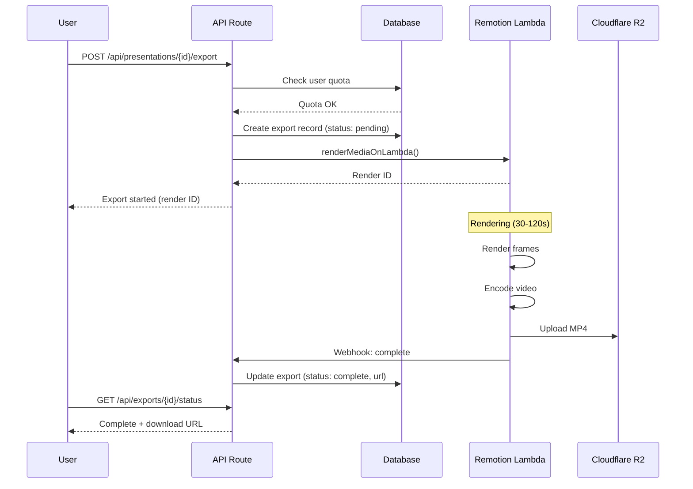

# Feature: Video Export

## Module
Export & Publish

## Overview
Video Export renders the presentation as an MP4 video file with synchronized animation and voice-over. This uses Remotion Lambda for serverless video rendering, enabling scalable production-quality exports.

## User Stories

### US-VE-001: Export Presentation as Video
**As a** content creator  
**I want to** export my presentation as an MP4 video  
**So that** I can share it on YouTube, social media, or embed it

**Acceptance Criteria:**
- [ ] One-click export button
- [ ] Progress indicator during rendering
- [ ] Download link when complete
- [ ] Email notification option for long renders

### US-VE-002: Select Video Quality
**As a** content creator  
**I want to** choose video resolution  
**So that** I can balance quality and file size

**Acceptance Criteria:**
- [ ] Options: 720p, 1080p (default), 4K (Pro tier)
- [ ] Estimated file size shown
- [ ] 4K restricted to paid plans
- [ ] Quality affects render time

### US-VE-003: Free Tier Watermark
**As a** free tier user  
**I understand** my exports will have a watermark  
**So that** I can upgrade for watermark-free exports

**Acceptance Criteria:**
- [ ] Subtle watermark in corner
- [ ] Watermark shows "Made with VisualFlow"
- [ ] Upgrade prompt before export
- [ ] Watermark not on paid tier exports

### US-VE-004: Track Export Usage
**As a** free tier user  
**I want to** see my remaining exports  
**So that** I know when I need to upgrade

**Acceptance Criteria:**
- [ ] Counter shows X/Y exports used this month
- [ ] Warning at 80% usage
- [ ] Block with upgrade prompt at limit
- [ ] Counter resets monthly

## Technical Specifications

### Remotion Lambda Setup

> **Implementation**: See `remotion.config.ts` for Remotion CLI configuration and Lambda settings (region, memory, timeout)

### Rendering Pipeline



### API Endpoints

> **Implementation**: See `src/types/billing.ts` for ExportRequest, ExportResponse, and ExportStatusResponse interfaces

### Export Handler

> **Implementation**: See `src/services/export/video-export.ts` for the export logic (quota checking, quality config, Lambda render trigger) and `src/app/api/presentations/[id]/export/route.ts` for the API route handler

### Remotion Composition

> **Implementation**: See `src/remotion/compositions/Presentation.tsx` for the Presentation component (slide sequencing, voice-over audio, watermark overlay)

### Progress Polling

> **Implementation**: See `src/hooks/use-export-progress.ts` for the `useExportProgress` hook (client-side polling with 3-second intervals)

## UI Components

### Export Dialog

```
┌─────────────────────────────────────────────────────────────┐
│  Export Video                                          [X]  │
├─────────────────────────────────────────────────────────────┤
│                                                             │
│  Quality                                                    │
│  ○ 720p (HD) - ~50MB, fastest                              │
│  ● 1080p (Full HD) - ~100MB, recommended                   │
│  ○ 4K (Ultra HD) - ~300MB, Pro only 🔒                     │
│                                                             │
│  Options                                                    │
│  ☑ Include voice-over                                       │
│  ☐ Email me when ready                                      │
│                                                             │
│  ─────────────────────────────────────                      │
│  Estimated render time: ~45 seconds                         │
│  Your exports this month: 3/5                               │
│                                                             │
│  ⚠️ Free tier exports include watermark                     │
│  [Upgrade to Pro for watermark-free exports]                │
│                                                             │
│              [Cancel]  [Export Video]                       │
└─────────────────────────────────────────────────────────────┘
```

### Export Progress

```
┌─────────────────────────────────────────────────────────────┐
│  Exporting...                                               │
├─────────────────────────────────────────────────────────────┤
│                                                             │
│  ████████████████████░░░░░░░░░░░░░░░░░░░░  47%             │
│                                                             │
│  Rendering slide 6 of 12...                                 │
│  Estimated time remaining: 25 seconds                       │
│                                                             │
│  💡 Tip: You can close this dialog - we'll notify you       │
│     when your video is ready.                               │
│                                                             │
│              [Cancel Export]                                │
└─────────────────────────────────────────────────────────────┘
```

## Cost Analysis

| Resolution | Lambda Duration | Lambda Cost | R2 Storage (30 days) | Total/Export |
|------------|----------------|-------------|----------------------|--------------|
| 720p | ~30s | $0.03 | $0.001 | ~$0.03 |
| 1080p | ~60s | $0.06 | $0.002 | ~$0.06 |
| 4K | ~120s | $0.12 | $0.006 | ~$0.13 |

**At 200 exports/day (1080p)**: ~$12/day = ~$360/month

## Dependencies
- Remotion + Remotion Lambda
- Cloudflare R2 for video storage
- Database for export tracking
- Stripe for quota enforcement

## Related Features
- [Web Player](./web-player.md)
- [Subscription Billing](../user-management/subscription-billing.md)
