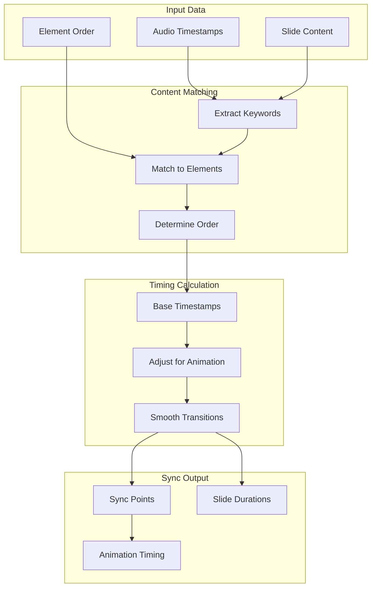

# Feature: Audio Timeline Sync

## Module
Voice Sync

## Overview
Audio Timeline Sync is the core technology that automatically synchronizes voice-over audio with slide animations. This is a key differentiator that eliminates the tedious manual timing work typically required in video production.

## User Stories

### US-ATS-001: Auto-Sync Voice to Animation
**As a** content creator  
**I want** my voice-over to automatically sync with slide animations  
**So that** elements appear as they're being spoken about

**Acceptance Criteria:**
- [ ] Animations trigger based on audio timestamps
- [ ] Smooth timing without jarring cuts
- [ ] Works with AI-generated and uploaded audio
- [ ] Sync adjusts when audio is regenerated

### US-ATS-002: Visual Sync Timeline
**As a** content creator  
**I want to** see a visual representation of audio-to-slide sync  
**So that** I can verify the timing is correct

**Acceptance Criteria:**
- [ ] Waveform display under timeline
- [ ] Markers showing slide boundaries
- [ ] Highlighted current word during playback
- [ ] Visual indicator of sync points

### US-ATS-003: Manual Timing Adjustment
**As a** content creator  
**I want to** manually adjust sync timing  
**So that** I can fine-tune when elements appear

**Acceptance Criteria:**
- [ ] Drag sync points to adjust
- [ ] Input specific timestamp
- [ ] Preview changes immediately
- [ ] Reset to auto-calculated timing

### US-ATS-004: Slide Duration Auto-Adjust
**As a** content creator  
**I want** slide durations to automatically match voice-over length  
**So that** slides don't end before narration finishes

**Acceptance Criteria:**
- [ ] Slide extends to match audio
- [ ] Minimum padding after last word (0.5s)
- [ ] Can override auto-duration
- [ ] Handles variable-length audio

## Sync Algorithm

### Sync Point Calculation



### Core Sync Logic

> **Implementation**: See `src/types/voice.ts` for SyncPoint and SlideSync interfaces, and `src/lib/tts/sync.ts` for the `calculateSync` algorithm (keyword extraction, timestamp matching with anticipation offset, stagger fallback, duration calculation)

### Remotion Integration

> **Implementation**: See `src/remotion/elements/AnimatedElement.tsx` for the synced slide component that uses sync points to trigger element animations via Remotion's `interpolate`

## UI Components

### Sync Timeline Visualization

```
┌─────────────────────────────────────────────────────────────────────────┐
│  Audio Sync Timeline                                                    │
├─────────────────────────────────────────────────────────────────────────┤
│                                                                         │
│  Waveform: ▁▂▃▅▇▅▃▂▁▂▃▅▇▅▃▂▁▁▂▃▅▇▅▃▂▁▂▃▅▇▅▃▂▁                          │
│            │    │         │              │                              │
│            ▼    ▼         ▼              ▼                              │
│  Elements: [Title]  [Bullet 1]  [Bullet 2]  [Bullet 3]                 │
│                                                                         │
│  Sync Points: ●────────●──────────●──────────────●                      │
│               0:00     0:02       0:05           0:08                   │
│                                                                         │
│  ──────────────────────●──────────────────────────────                  │
│                      0:04.2                                             │
└─────────────────────────────────────────────────────────────────────────┘
```

### Sync Point Editor

> **Implementation**: See `src/components/editor/` for the SyncPointEditor component (waveform display, draggable sync point markers, playback scrubber) — TODO

## Data Model

> **Implementation**: See `src/types/voice.ts` for VoiceConfig, SlideVoiceConfig, and SyncAdjustment interfaces

## Dependencies
- Text-to-Speech module for audio + timestamps
- Remotion for synced playback
- Web Audio API for waveform generation

## Related Features
- [Text-to-Speech](./text-to-speech.md)
- [Timeline View](../story-editor/timeline-view.md)
- [Video Export](../export-publish/video-export.md)
