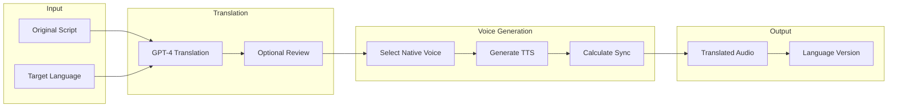

# Feature: Multi-Language Voice-Over

## Module
Voice Sync

## Overview
Multi-language support enables content creators to generate voice-overs in multiple languages from a single script. This feature is planned for Phase 2 and will leverage AI translation combined with multilingual TTS.

## Status
**Phase 2** - Not included in MVP

## User Stories

### US-ML-001: Generate Voice in Different Language
**As a** content creator  
**I want to** generate voice-over in a different language  
**So that** I can reach international audiences

**Acceptance Criteria:**
- [ ] Language selector with 10+ languages
- [ ] AI translates script maintaining meaning
- [ ] Native-sounding voice in target language
- [ ] Preserves timing and sync points

### US-ML-002: Maintain Multiple Language Versions
**As a** content creator  
**I want to** keep multiple language versions of my project  
**So that** I can export videos for different markets

**Acceptance Criteria:**
- [ ] Switch between language versions
- [ ] Each version has own audio + sync
- [ ] Visual content remains the same
- [ ] Export any language version

### US-ML-003: Review and Edit Translations
**As a** content creator  
**I want to** review and edit AI translations  
**So that** I can ensure accuracy

**Acceptance Criteria:**
- [ ] Side-by-side original and translation
- [ ] Edit translation text
- [ ] Regenerate audio after edits
- [ ] Flag for human review option

## Supported Languages (Phase 2 Target)

| Language | Code | ElevenLabs Support | Priority |
|----------|------|-------------------|----------|
| English | en | Native | MVP |
| Spanish | es | Native | High |
| French | fr | Native | High |
| German | de | Native | High |
| Portuguese | pt | Native | Medium |
| Italian | it | Native | Medium |
| Japanese | ja | Native | Medium |
| Korean | ko | Native | Medium |
| Chinese (Mandarin) | zh | Native | Medium |
| Hindi | hi | Supported | Low |

## Technical Approach

### Translation Pipeline



### Translation with Context Preservation

> **Implementation**: See `src/types/voice.ts` for TranslationRequest interface and `src/services/translation/translate.ts` for the `translateScript` function (GPT-4 translation with context, tone, and emphasis preservation)

### Multi-Language Data Model

> **Implementation**: See `src/types/voice.ts` for the LanguageVersion interface (translated content per slide, audio URLs, sync points, review metadata)

### Voice Selection per Language

> **Implementation**: See `src/config/voices.ts` for the `languageVoices` configuration (voice options per language code with gender and name)

## UI Design (Phase 2)

### Language Version Selector

```
┌─────────────────────────────────────────────────────────────┐
│  Language Versions                                          │
├─────────────────────────────────────────────────────────────┤
│                                                             │
│  [🇺🇸 English (Original)] ✓                                 │
│  [🇪🇸 Spanish] ✓  Audio generated                           │
│  [🇫🇷 French] ○  Click to generate                          │
│  [+ Add Language]                                           │
│                                                             │
│  ─────────────────────────────────────────                  │
│                                                             │
│  Current: Spanish                                           │
│  Voice: Sofia (Female)  [Change]                            │
│                                                             │
│  [Preview Spanish] [Export Spanish Video]                   │
│                                                             │
└─────────────────────────────────────────────────────────────┘
```

## Cost Considerations

- **Translation**: ~$0.002 per 1K characters (GPT-4o)
- **TTS**: Same as single-language (per character)
- **Total per additional language**: ~$0.30-0.50 per video

## Dependencies
- OpenAI API for translation
- ElevenLabs multilingual voices
- Text-to-Speech module
- Audio Timeline Sync

## Phase 2 Implementation Notes

1. Start with 5 high-demand languages
2. Allow user-submitted translations for accuracy
3. Cache common phrase translations
4. Consider community translation marketplace

## Related Features
- [Text-to-Speech](./text-to-speech.md)
- [Audio Timeline Sync](./audio-timeline-sync.md)
