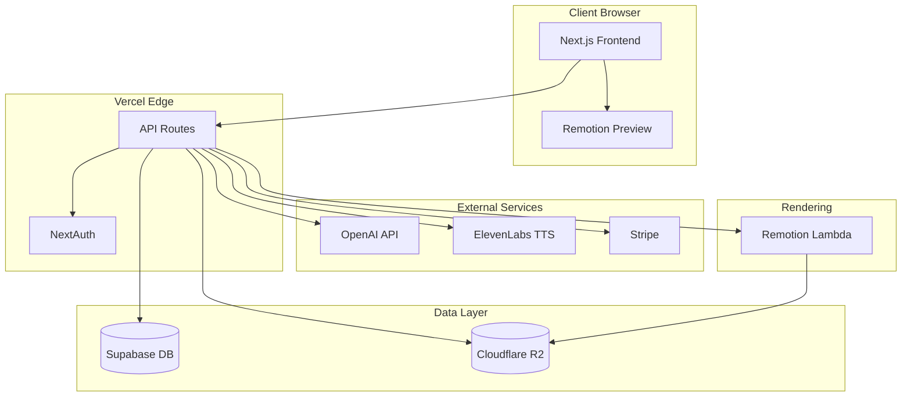

# MVP - Minimum Viable Product

## 1. MVP Vision Statement

Deliver the **simplest product that proves the core value proposition**:
> "Turn your script into an animated video with synchronized voice-over in minutes, not hours."

---

## 2. MVP Scope: What's IN

### 2.1. Core User Flow

```
┌─────────────┐    ┌─────────────┐    ┌─────────────┐    ┌─────────────┐    ┌─────────────┐
│   INPUT     │    │   GENERATE  │    │    EDIT     │    │   PREVIEW   │    │   EXPORT    │
│   Script    │───►│   Slides +  │───►│   Adjust    │───►│   With      │───►│   Video or  │
│   + Intent  │    │   Animation │    │   Refine    │    │   Voice     │    │   Web Link  │
└─────────────┘    └─────────────┘    └─────────────┘    └─────────────┘    └─────────────┘
```

### 2.2. MVP Features by Module

#### Module 1: Story Editor
| Feature | MVP Scope | Details |
|---------|-----------|---------|
| Script input | ✅ IN | Text area for script with section markers |
| AI script feedback | ✅ IN | Suggestions for hook, structure, CTA |
| Intent/tone selection | ✅ IN | Dropdown: educational, promotional, storytelling |

#### Module 2: Animation Engine
| Feature | MVP Scope | Details |
|---------|-----------|---------|
| Animation templates | ✅ IN | 10-15 pre-built animation patterns |
| Auto-animation from script | ✅ IN | AI selects templates based on content |
| Slide transitions | ✅ IN | 5-7 transition types (fade, slide, zoom) |
| Element animations | ✅ IN | Appear, fade, move, scale, highlight |
| Custom keyframe editor | ❌ OUT | Phase 2 - too complex for MVP |

#### Module 3: Voice Sync
| Feature | MVP Scope | Details |
|---------|-----------|---------|
| Text-to-speech | ✅ IN | Integration with ElevenLabs (3-5 voice options) |
| Auto-sync voice to animation | ✅ IN | Core differentiator - must be in MVP |
| Voice upload | ⚠️ MINIMAL | Upload only, no editing |
| Multi-language | ❌ OUT | Phase 2 |

#### Module 4: AI Assistant
| Feature | MVP Scope | Details |
|---------|-----------|---------|
| Script feedback | ✅ IN | OpenAI integration for structure suggestions |
| Visual suggestions | ⚠️ MINIMAL | Suggest icons from library (no generation) |
| Regenerate with prompt | ✅ IN | "Make this slide more dynamic" type prompts |
| Image generation | ❌ OUT | Phase 2 - use placeholder/stock library |

#### Module 5: Export & Publish
| Feature | MVP Scope | Details |
|---------|-----------|---------|
| Video export (MP4) | ✅ IN | 1080p via Remotion |
| Web player link | ✅ IN | Shareable URL with embedded player |
| Interactive mode | ⚠️ MINIMAL | Click to advance, no hover details |
| PDF/PPTX export | ❌ OUT | Phase 2 |

#### Module 6: User Management
| Feature | MVP Scope | Details |
|---------|-----------|---------|
| Authentication | ✅ IN | Email + Google OAuth |
| Projects library | ✅ IN | Save/load projects |
| Freemium limits | ✅ IN | Track exports, enforce limits |
| Stripe billing | ✅ IN | Subscription management |
| Team collaboration | ❌ OUT | Phase 2 |

---

## 3. MVP Scope: What's OUT (Phase 2+)

| Feature | Reason for Exclusion |
|---------|---------------------|
| Data source linking (Jira/Asana) | Different user segment, adds complexity |
| Multi-language voice-over | Adds TTS complexity, can layer on later |
| Image/video generation | Expensive, use stock library + placeholders |
| Custom keyframe animation editor | Too complex, defeats "simple" value prop |
| Collaboration features | Solo creators are MVP target |
| Brand kit / custom themes | Nice-to-have, not core value |
| Mobile app | Web-first for MVP |

---

## 4. User Experience Flow (Detailed)

### Step 1: Onboarding (First-time user)
1. User lands on homepage → sees example animations
2. "Try it free" → Email signup or Google OAuth
3. Quick tutorial (30 sec): "Paste your script → We animate it"

### Step 2: Create New Project
1. User clicks "New Story"
2. Enters project name and selects intent (educational/promotional/story)
3. Pastes or types script in editor
4. (Optional) Uses AI to improve script structure

### Step 3: Generate Slides
1. User clicks "Generate Animation"
2. System analyzes script → breaks into slides/sub-slides
3. AI selects animation templates for each section
4. Progress indicator shows generation status (15-30 seconds)
5. Preview appears with all slides in timeline view

### Step 4: Edit & Refine
1. User reviews slides in timeline
2. Can click any slide to:
   - Regenerate with prompt ("make this more dynamic")
   - Swap animation template
   - Edit text content
   - Adjust timing (simple slider, not keyframes)
3. Changes apply instantly in preview

### Step 5: Add Voice-Over
1. User selects voice from dropdown (5 options)
2. Clicks "Generate Voice"
3. System generates TTS and auto-syncs to animations
4. User can preview with voice
5. (Optional) Upload own voice recording

### Step 6: Export
1. User clicks "Export"
2. Chooses: Video (MP4) or Web Link
3. For free tier: watermark warning, upgrade prompt
4. Rendering happens (30-60 seconds)
5. Download link or shareable URL provided

---

## 5. Technical MVP Requirements

### 5.1. Technology Stack

| Layer | Technology | Rationale |
|-------|------------|-----------|
| Frontend | Next.js 14+ (App Router) | SSR, API routes, great DX |
| Language | TypeScript | Type safety, better tooling |
| Styling | Tailwind CSS | Rapid UI development |
| State | Zustand or Jotai | Simple, performant state management |
| Video Rendering | Remotion | React-based video, serverless rendering |
| Backend | Next.js API Routes | Unified codebase, serverless |
| Database | PostgreSQL (Supabase) | Projects, users, subscriptions |
| Auth | NextAuth.js or Clerk | OAuth + email, session management |
| AI - Script | OpenAI GPT-4 | Script analysis, suggestions |
| AI - Voice | ElevenLabs | High-quality TTS |
| Storage | Cloudflare R2 | Cost-effective, S3-compatible |
| Payments | Stripe | Subscriptions, usage tracking |
| Hosting | Vercel | Optimal for Next.js |

### 5.2. Architecture Diagram



### 5.3. Data Models (Core)

```typescript
// User
interface User {
  id: string;
  email: string;
  name: string;
  plan: 'free' | 'creator' | 'pro';
  exportsThisMonth: number;
  stripeCustomerId?: string;
  createdAt: Date;
}

// Project
interface Project {
  id: string;
  userId: string;
  name: string;
  script: string;
  intent: 'educational' | 'promotional' | 'storytelling';
  slides: Slide[];
  voiceSettings: VoiceSettings;
  status: 'draft' | 'generated' | 'exported';
  createdAt: Date;
  updatedAt: Date;
}

// Slide
interface Slide {
  id: string;
  order: number;
  content: string;
  animationTemplate: string;
  elements: SlideElement[];
  duration: number; // milliseconds
  transition: TransitionType;
}

// SlideElement
interface SlideElement {
  id: string;
  type: 'text' | 'icon' | 'shape' | 'image';
  content: string;
  animation: AnimationConfig;
  position: { x: number; y: number };
  style: ElementStyle;
}

// VoiceSettings
interface VoiceSettings {
  voiceId: string;
  audioUrl?: string;
  syncPoints: SyncPoint[]; // timestamp -> slide/element mapping
}
```

### 5.4. API Endpoints (MVP)

| Endpoint | Method | Purpose |
|----------|--------|---------|
| `/api/auth/*` | * | NextAuth handlers |
| `/api/projects` | GET, POST | List/create projects |
| `/api/projects/[id]` | GET, PUT, DELETE | Project CRUD |
| `/api/projects/[id]/generate` | POST | Generate slides from script |
| `/api/projects/[id]/regenerate-slide` | POST | Regenerate single slide |
| `/api/projects/[id]/voice` | POST | Generate voice-over |
| `/api/projects/[id]/export` | POST | Trigger video render |
| `/api/ai/script-feedback` | POST | Get AI script suggestions |
| `/api/billing/checkout` | POST | Create Stripe checkout |
| `/api/billing/portal` | POST | Stripe customer portal |
| `/api/webhooks/stripe` | POST | Stripe webhook handler |

---

## 6. MVP Success Metrics

### 6.1. Launch Criteria (Before Public Launch)
- [ ] User can sign up and create account
- [ ] User can input script and generate animated slides
- [ ] Voice-over generates and syncs with animation
- [ ] Video exports successfully (MP4, 1080p)
- [ ] Web player link works and is shareable
- [ ] Stripe billing works (free → paid upgrade)
- [ ] 90%+ of renders complete without errors

### 6.2. Success Metrics (Post-Launch, 90 days)
| Metric | Target | Measurement |
|--------|--------|-------------|
| Signups | 1,000 | Total registered users |
| Activation | 40% | Users who complete first export |
| Retention | 25% | Weekly active users (WAU) |
| Conversion | 5% | Free → paid conversion |
| NPS | 40+ | Net Promoter Score |

---

## 7. MVP Timeline Estimate

| Phase | Duration | Deliverables |
|-------|----------|--------------|
| **Foundation** | 2-3 weeks | Auth, DB, project CRUD, basic UI shell |
| **Animation Engine** | 3-4 weeks | Templates, Remotion integration, preview |
| **AI Integration** | 2 weeks | OpenAI script analysis, slide generation |
| **Voice Sync** | 2 weeks | ElevenLabs TTS, sync algorithm |
| **Export & Billing** | 2 weeks | Remotion Lambda, Stripe integration |
| **Polish & Testing** | 2 weeks | Bug fixes, UX improvements, load testing |
| **Total** | ~13-15 weeks | Production-ready MVP |

---

## 8. Risks & Mitigations

| Risk | Impact | Mitigation |
|------|--------|------------|
| Voice sync quality poor | High | Invest time in sync algorithm; fallback to manual timing adjustment |
| Remotion rendering slow/expensive | Medium | Use Lambda for parallel rendering; cache common templates |
| AI generation inconsistent | Medium | Constrain AI output format; use structured prompts |
| ElevenLabs rate limits | Low | Cache generated audio; implement queue system |
| Scope creep | High | Strict feature freeze after MVP scope defined |
