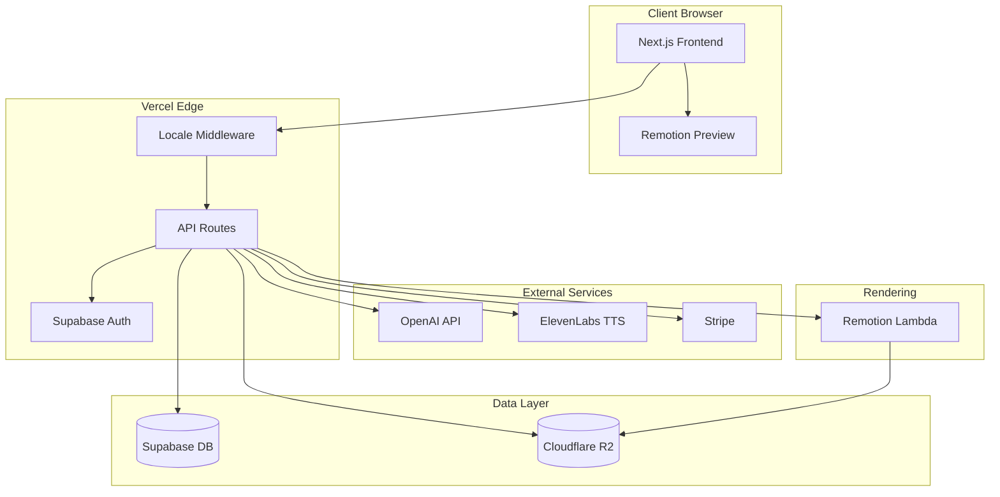

# MVP Architecture

> Technical architecture details for the VisualStory MVP.
> For MVP scope and features, see [MVP - Minimum Viable Product](./MVP-Minimum-Viable-Product.md).
> For the full technical architecture, see [Technical Architecture Overview](../technical-architecture/overview.md).

---

## 1. Technology Stack

| Layer | Technology | Rationale |
|-------|------------|-----------|
| Frontend | Next.js 14+ (App Router) | SSR, API routes, great DX |
| Language | TypeScript | Type safety, better tooling |
| Styling | Tailwind CSS | Rapid UI development |
| UI Components | shadcn/ui | Accessible, customizable component library built on Radix UI |
| State | Zustand | Simple, performant state management |
| Video Rendering | Remotion | React-based video, serverless rendering |
| Backend | Next.js API Routes | Unified codebase, serverless |
| Database | PostgreSQL (Supabase) | Projects, users, tenants, subscriptions |
| Auth | Supabase Auth | OAuth, email auth, session management, RLS integration |
| i18n | next-intl (or equivalent) | URL-based locale routing (`/{locale}/...`) |
| AI - Script | OpenAI GPT-4 | Script analysis, suggestions |
| AI - Voice | ElevenLabs | High-quality TTS |
| Storage | Cloudflare R2 | Cost-effective, S3-compatible |
| Payments | Stripe | Subscriptions, usage tracking |
| Hosting | Vercel | Optimal for Next.js |

---

## 2. Architecture Diagram



---

## 3. Data Models (Core)

```typescript
// User
interface User {
  id: string;
  email: string;
  name: string;
  avatarUrl?: string;
  createdAt: Date;
}

// Tenant (Workspace)
interface Tenant {
  id: string;
  name: string;
  slug: string;
  plan: 'free' | 'creator' | 'pro';
  exportsThisMonth: number;
  stripeCustomerId?: string;
  createdAt: Date;
}

// TenantMembership
interface TenantMembership {
  id: string;
  tenantId: string;
  userId: string;
  role: 'owner' | 'admin' | 'editor' | 'viewer';
  joinedAt: Date;
}

// Project
interface Project {
  id: string;
  tenantId: string;
  createdByUserId: string;
  name: string;
  script: string;
  intent: string;
  slides: Slide[];
  voiceSettings: VoiceSettings;
  status: 'draft' | 'generated' | 'exported';
  createdAt: Date;
  updatedAt: Date;
}

// Slide
interface Slide {
  id: string;
  order: number;
  content: string;
  animationTemplate: string;
  elements: SlideElement[];
  duration: number; // milliseconds
  transition: TransitionType;
}

// SlideElement
interface SlideElement {
  id: string;
  type: 'text' | 'icon' | 'shape' | 'image';
  content: string;
  animation: AnimationConfig;
  position: { x: number; y: number };
  style: ElementStyle;
}

// VoiceSettings
interface VoiceSettings {
  voiceId: string;
  audioUrl?: string;
  syncPoints: SyncPoint[]; // timestamp -> slide/element mapping
}
```

> **Note:** The `Tenant` and `TenantMembership` models support the multi-tenant architecture. See the multi-tenant requirements in the [MVP doc](./MVP-Minimum-Viable-Product.md) for scope details. Exact roles and permissions will be refined based on product decisions.

---

## 4. API Endpoints (MVP)

| Endpoint | Method | Purpose |
|----------|--------|---------|
| `/api/auth/*` | * | Supabase Auth handlers |
| `/api/tenants` | GET, POST | List user's workspaces, create workspace |
| `/api/tenants/[id]/members` | GET, POST | List/invite workspace members |
| `/api/projects` | GET, POST | List/create projects (scoped to active tenant) |
| `/api/projects/[id]` | GET, PUT, DELETE | Project CRUD |
| `/api/projects/[id]/generate` | POST | Generate slides from script |
| `/api/projects/[id]/regenerate-slide` | POST | Regenerate single slide |
| `/api/projects/[id]/voice` | POST | Generate voice-over |
| `/api/projects/[id]/export` | POST | Trigger video render |
| `/api/ai/script-feedback` | POST | Get AI script suggestions |
| `/api/billing/checkout` | POST | Create Stripe checkout |
| `/api/billing/portal` | POST | Stripe customer portal |
| `/api/webhooks/stripe` | POST | Stripe webhook handler |
