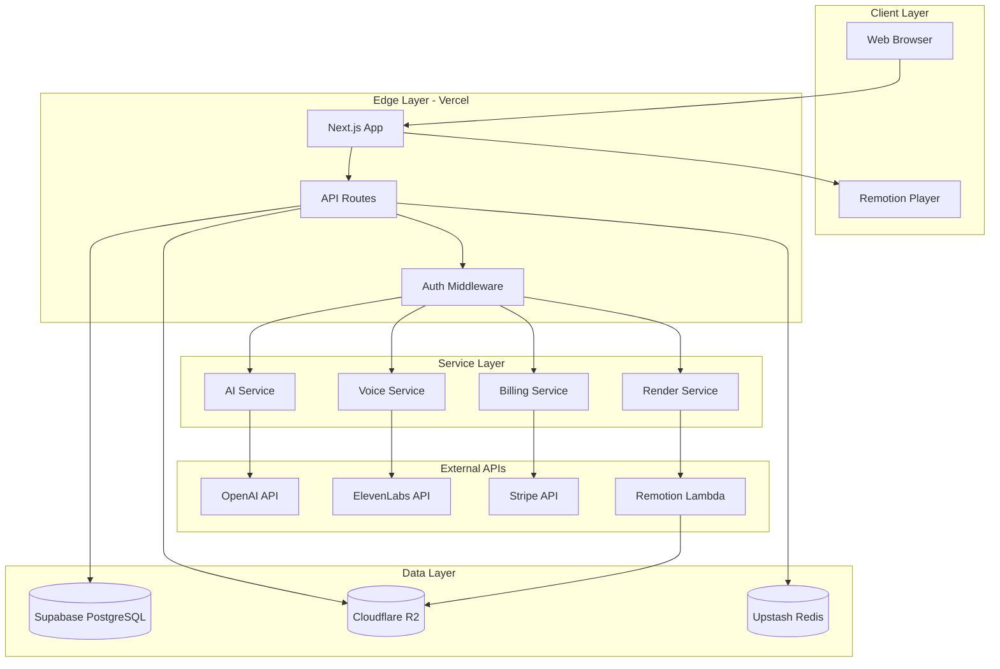
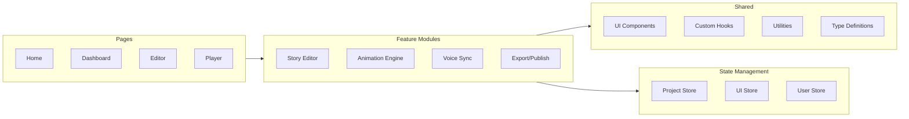
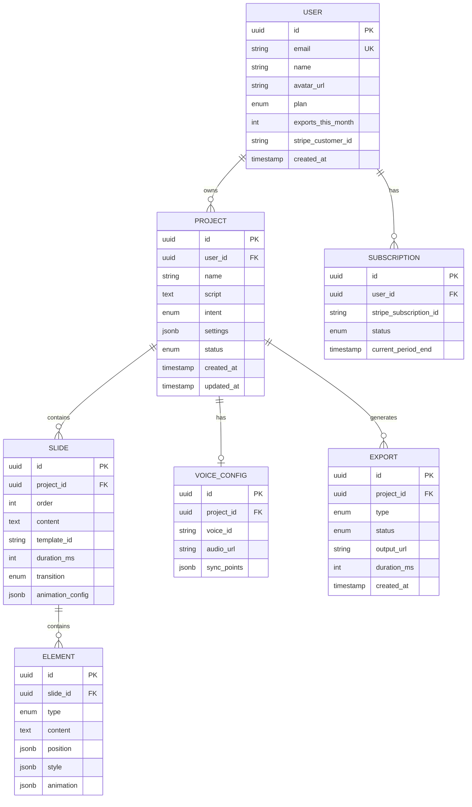
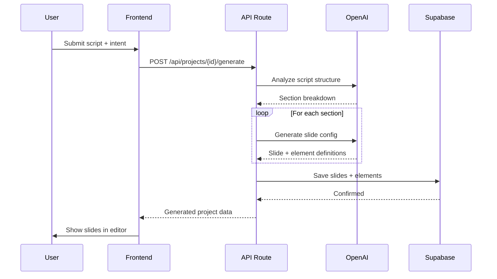
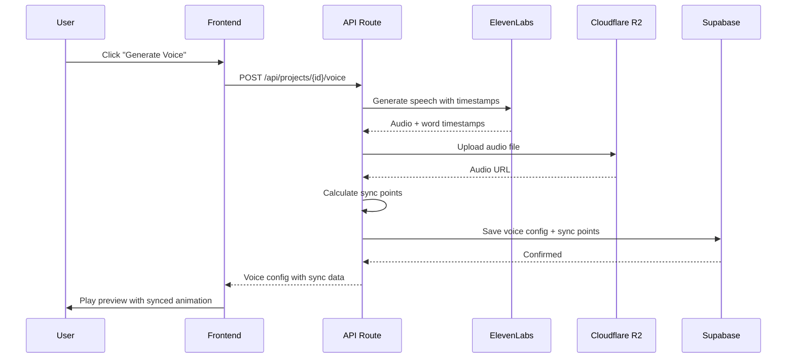
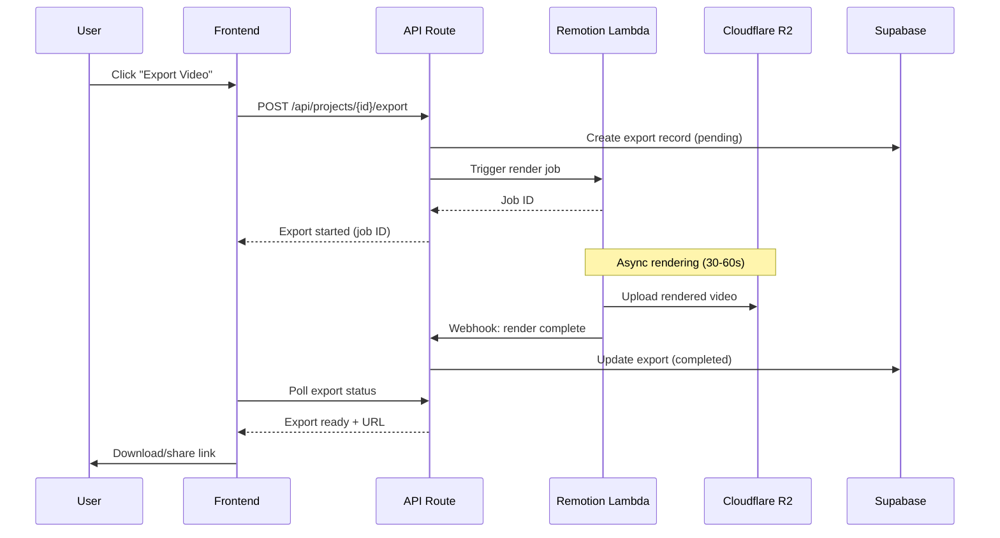
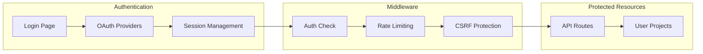

# Technical Architecture Overview

## 1. Architecture Principles

1. **Simplicity First**: Use managed services where possible to minimize ops burden
2. **Serverless-Native**: Leverage edge/serverless for cost efficiency and scalability
3. **React Everywhere**: Next.js frontend + Remotion video = unified React mental model
4. **Type Safety**: TypeScript throughout for reliability and developer experience
5. **Cost-Conscious**: Optimize for startup budget (R2 over S3, Vercel free tier friendly)

---

## 2. Technology Stack

### 2.1. Core Stack Summary

| Layer | Technology | Version | Purpose |
|-------|------------|---------|---------|
| **Frontend** | Next.js | 14+ | App Router, SSR, API routes |
| **Language** | TypeScript | 5.x | Type safety |
| **Styling** | Tailwind CSS | 3.x | Utility-first CSS |
| **UI Components** | shadcn/ui | latest | Accessible, customizable components |
| **State** | Zustand | 4.x | Lightweight global state |
| **Video Engine** | Remotion | 4.x | React-based video rendering |
| **Database** | PostgreSQL | 15+ | Via Supabase |
| **ORM** | Prisma | 5.x | Type-safe database access |
| **Auth** | NextAuth.js | 5.x (Auth.js) | OAuth + credentials |
| **AI - LLM** | OpenAI | GPT-4o | Script analysis, generation |
| **AI - TTS** | ElevenLabs | v1 | Text-to-speech |
| **Storage** | Cloudflare R2 | - | S3-compatible object storage |
| **Payments** | Stripe | - | Subscriptions, metering |
| **Hosting** | Vercel | - | Frontend + API |
| **Video Render** | Remotion Lambda | - | Serverless video rendering |

### 2.2. Stack Rationale

#### Why Next.js + Remotion?
- **Next.js**: Industry standard for React apps, excellent DX, built-in API routes eliminates need for separate backend
- **Remotion**: Only production-ready React-based video framework; enables reusing React components for video
- **Synergy**: Same component can render in browser preview AND in final video export

#### Why Supabase over Firebase?
- PostgreSQL = relational queries, better for project/slide relationships
- Row-level security for multi-tenant data
- Generous free tier, predictable pricing
- Better TypeScript/Prisma integration

#### Why Cloudflare R2 over AWS S3?
- Zero egress fees (critical for video streaming)
- S3-compatible API (easy migration if needed)
- Global distribution via Cloudflare CDN

#### Alternatives Considered

| Choice | Alternative | Why Not |
|--------|-------------|---------|
| Remotion | FFmpeg + custom | Would require building animation system from scratch |
| Supabase | PlanetScale | MySQL less suited for complex relationships |
| ElevenLabs | AWS Polly | Lower voice quality, less natural |
| Vercel | Railway | Less optimized for Next.js, more ops work |

---

## 3. System Architecture

### 3.1. High-Level Architecture



### 3.2. Component Architecture



---

## 4. Data Architecture

### 4.1. Database Schema (ERD)



### 4.2. Storage Strategy

| Data Type | Storage | Retention | Access Pattern |
|-----------|---------|-----------|----------------|
| User data | Supabase | Permanent | Frequent read/write |
| Project data | Supabase | Permanent | Frequent read/write |
| Generated audio | R2 | 90 days | Read-heavy, CDN cached |
| Exported videos | R2 | 30 days (free) / 1 year (paid) | Read-heavy, CDN cached |
| Temp render files | R2 | 24 hours | Write once, read once |
| Session data | Upstash Redis | 7 days | High frequency |

---

## 5. Key Technical Flows

### 5.1. Script-to-Slides Generation



### 5.2. Voice Generation & Sync



### 5.3. Video Export



---

## 6. Security Architecture

### 6.1. Authentication Flow



### 6.2. Security Measures

| Layer | Measure | Implementation |
|-------|---------|----------------|
| Auth | OAuth 2.0 + JWT | NextAuth.js with secure cookies |
| API | Rate limiting | Upstash Redis rate limiter |
| Data | Row-level security | Supabase RLS policies |
| Storage | Signed URLs | Time-limited access to R2 objects |
| Payments | Webhook verification | Stripe signature validation |
| Frontend | CSP headers | Next.js security headers |

---

## 7. Scalability Considerations

### 7.1. Expected Load (MVP)

| Metric | Initial | Growth Target |
|--------|---------|---------------|
| DAU | 100 | 1,000 |
| Projects created/day | 50 | 500 |
| Videos exported/day | 20 | 200 |
| Storage (monthly) | 50 GB | 500 GB |

### 7.2. Scaling Strategy

| Component | Scaling Approach |
|-----------|------------------|
| Frontend | Vercel auto-scales (edge) |
| API | Vercel serverless (auto-scale) |
| Database | Supabase Pro tier (connection pooling) |
| Video Render | Remotion Lambda (parallel functions) |
| Storage | R2 (unlimited, pay-per-use) |
| AI Calls | Queue + rate limiting |

---

## 8. Cost Estimation (MVP)

### 8.1. Monthly Costs at 1,000 Users

| Service | Tier | Est. Cost |
|---------|------|-----------|
| Vercel | Pro | $20/month |
| Supabase | Pro | $25/month |
| Cloudflare R2 | Pay-as-you-go | $15/month (500GB) |
| Upstash Redis | Free tier | $0 |
| OpenAI | Pay-as-you-go | $50/month |
| ElevenLabs | Creator | $22/month |
| Remotion Lambda | Pay-per-render | $100/month |
| Stripe | 2.9% + $0.30 | Variable |
| **Total** | | **~$230/month** |

### 8.2. Cost Optimization

- Cache AI responses for common script patterns
- Use Remotion composition caching
- Implement smart garbage collection for R2
- Batch ElevenLabs requests where possible

---

## 9. Development Environment

### 9.1. Local Setup

```bash
# Prerequisites
node >= 20.x
pnpm >= 8.x

# Clone and install
git clone https://github.com/your-org/visualstory.git
cd visualstory
pnpm install

# Environment setup
cp .env.example .env.local
# Fill in API keys

# Database setup
pnpm db:push
pnpm db:seed

# Start development
pnpm dev
```

### 9.2. Project Structure

```
visualstory/
├── src/
│   ├── app/                    # Next.js App Router
│   │   ├── (auth)/            # Auth pages
│   │   ├── (dashboard)/       # Dashboard pages
│   │   ├── editor/[id]/       # Editor page
│   │   ├── player/[id]/       # Public player
│   │   └── api/               # API routes
│   │
│   ├── components/            # React components
│   │   ├── ui/               # shadcn/ui components
│   │   ├── editor/           # Editor-specific
│   │   ├── player/           # Player-specific
│   │   └── shared/           # Shared components
│   │
│   ├── features/             # Feature modules
│   │   ├── story-editor/
│   │   ├── animation-engine/
│   │   ├── voice-sync/
│   │   ├── ai-assistant/
│   │   └── export-publish/
│   │
│   ├── lib/                  # Utilities
│   │   ├── db/              # Prisma client
│   │   ├── ai/              # OpenAI helpers
│   │   ├── storage/         # R2 helpers
│   │   └── utils/           # General utils
│   │
│   ├── remotion/            # Remotion compositions
│   │   ├── compositions/
│   │   ├── templates/
│   │   └── components/
│   │
│   ├── stores/              # Zustand stores
│   └── types/               # TypeScript types
│
├── prisma/
│   └── schema.prisma        # Database schema
│
├── public/                  # Static assets
├── tests/                   # Test files
└── package.json
```

---

## 10. Related Documentation

- [Frontend Architecture](./frontend-architecture.md)
- [Backend Services](./backend-services.md)
- [Video Rendering Pipeline](./video-rendering-pipeline.md)
- [AI Integration](./ai-integration.md)
