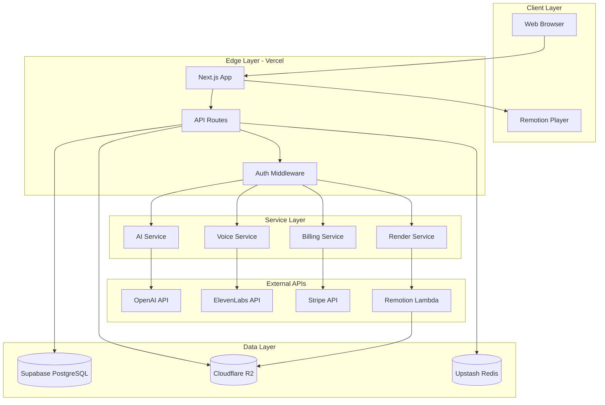
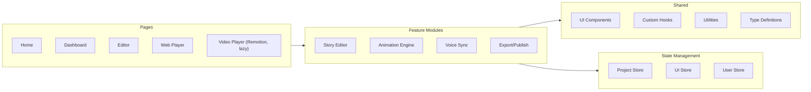
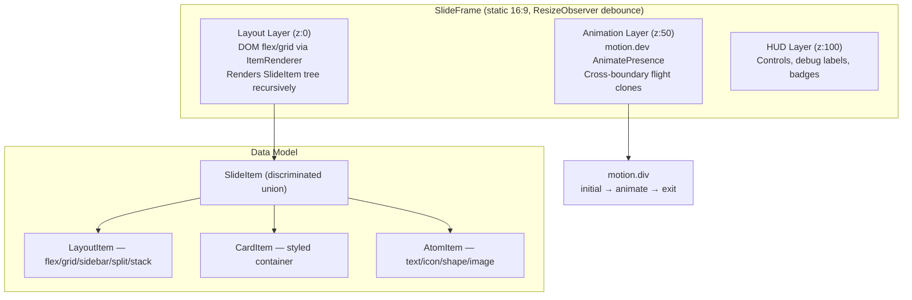
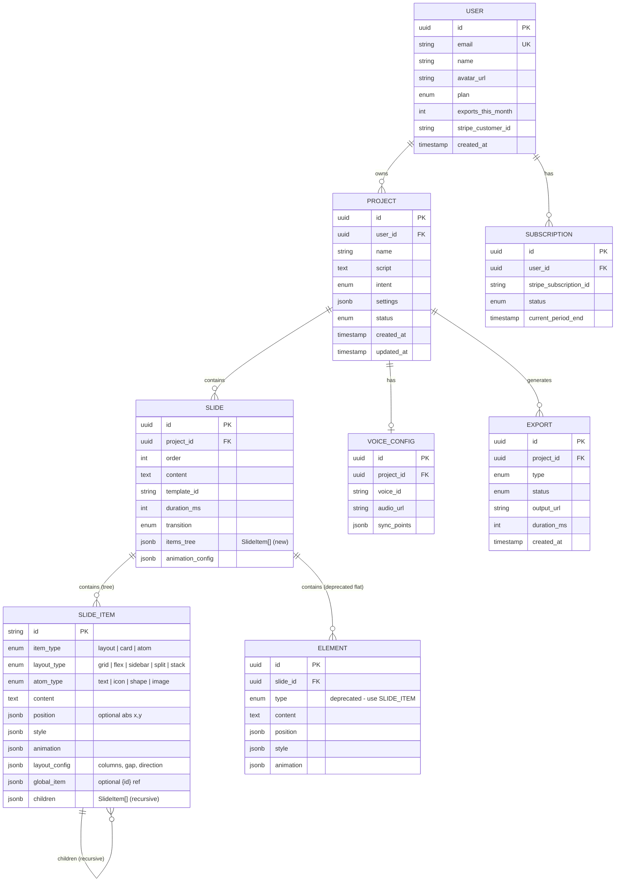
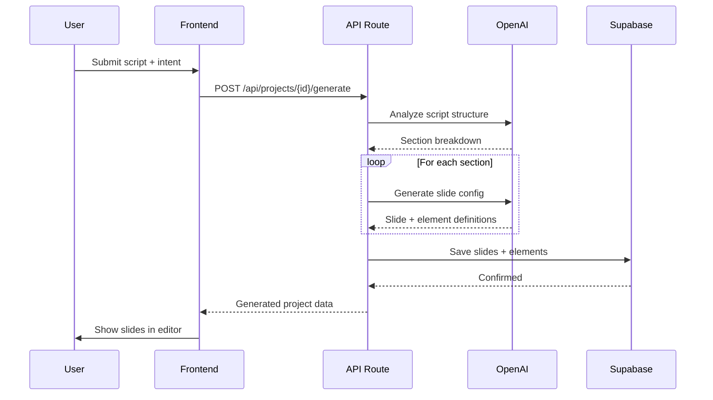
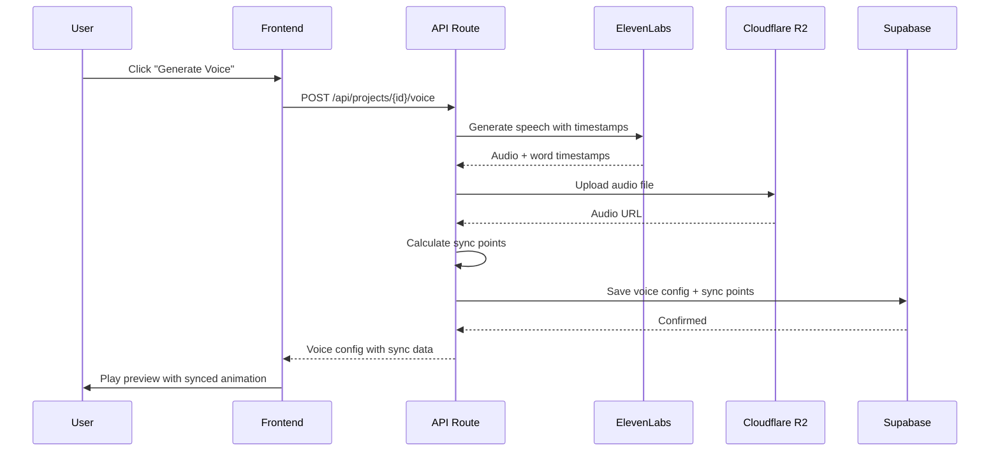
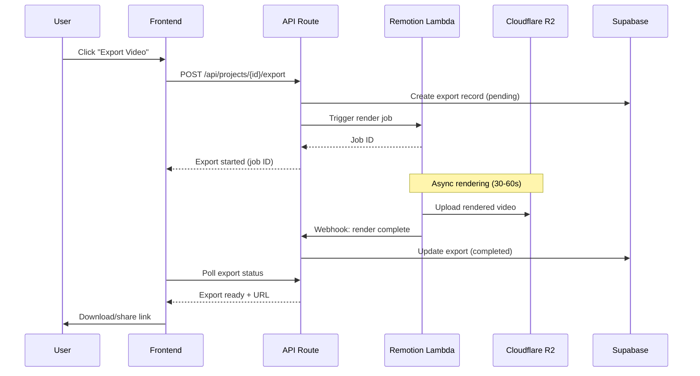
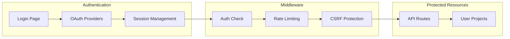

# Technical Architecture Overview

## 1. Architecture Principles

1. **Simplicity First**: Use managed services where possible to minimize ops burden
2. **Serverless-Native**: Leverage edge/serverless for cost efficiency and scalability
3. **React Everywhere**: Next.js frontend + Remotion video = unified React mental model
4. **Type Safety**: TypeScript throughout for reliability and developer experience
5. **Cost-Conscious**: Optimize for startup budget (R2 over S3, Vercel free tier friendly)

---

## 2. Technology Stack

### 2.1. Core Stack Summary

| Layer | Technology | Version | Purpose |
|-------|------------|---------|---------|
| **Frontend** | Next.js | 14+ | App Router, SSR, API routes |
| **Language** | TypeScript | 5.x | Type safety |
| **Styling** | Tailwind CSS | 3.x | Utility-first CSS |
| **UI Components** | shadcn/ui | latest | Accessible, customizable components |
| **State** | Zustand | 4.x | Lightweight global state |
| **Animation (web)** | motion (motion.dev) | 12.x | DOM animations, layout transitions, cross-boundary flights |
| **Video Engine** | Remotion | 4.x | React-based video rendering (lazy-loaded) |
| **Database** | PostgreSQL | 15+ | Via Supabase |
| **ORM** | Prisma | 5.x | Type-safe database access |
| **Auth** | NextAuth.js | 5.x (Auth.js) | OAuth + credentials |
| **AI - LLM** | OpenAI | GPT-4o | Script analysis, generation |
| **AI - TTS** | ElevenLabs | v1 | Text-to-speech |
| **Storage** | Cloudflare R2 | - | S3-compatible object storage |
| **Payments** | Stripe | - | Subscriptions, metering |
| **Hosting** | Vercel | - | Frontend + API |
| **Video Render** | Remotion Lambda | - | Serverless video rendering |

### 2.2. Stack Rationale

#### Why Next.js + Remotion + motion.dev?
- **Next.js**: Industry standard for React apps, excellent DX, built-in API routes eliminates need for separate backend
- **Remotion**: Only production-ready React-based video framework; enables reusing React components for video. Isolated in a separate route (`/slide-play-video`) and lazy-loaded via `next/dynamic` to keep the main player bundle small
- **motion.dev**: Powers the web animation layer — cross-boundary element flights, layout animations, and hover micro-interactions. Works alongside (not inside) Remotion: web player uses motion.dev, video export uses Remotion's `interpolate()`
- **Synergy**: Shared `SlideItem` data model consumed by both engines; `flattenItemsAsElements()` bridges the item tree to Remotion's flat rendering

#### Why Supabase over Firebase?
- PostgreSQL = relational queries, better for project/slide relationships
- Row-level security for multi-tenant data
- Generous free tier, predictable pricing
- Better TypeScript/Prisma integration

#### Why Cloudflare R2 over AWS S3?
- Zero egress fees (critical for video streaming)
- S3-compatible API (easy migration if needed)
- Global distribution via Cloudflare CDN

#### Alternatives Considered

| Choice | Alternative | Why Not |
|--------|-------------|---------|
| Remotion | FFmpeg + custom | Would require building animation system from scratch |
| Supabase | PlanetScale | MySQL less suited for complex relationships |
| ElevenLabs | AWS Polly | Lower voice quality, less natural |
| Vercel | Railway | Less optimized for Next.js, more ops work |

---

## 3. System Architecture

### 3.1. High-Level Architecture



### 3.2. Component Architecture



### 3.3. Slide Rendering Architecture (Approach E — Hybrid DOM + Overlay)

The web player uses a three-layer architecture inside a `SlideFrame` container:



**Key concepts:**

- **SlideItem tree**: Recursive `LayoutItem | CardItem | AtomItem` union replacing the flat `SlideElement[]` array. Layouts hold children, cards group items visually, atoms are leaf content nodes.
- **ItemRenderer**: Recursively walks the tree, rendering layouts as CSS flex/grid, cards as styled containers, atoms as content elements. Uses motion.dev for entrance/focus micro-animations.
- **AnimationLayer**: Renders "flight" clones for cross-boundary animations (e.g., moving an item from a grid to a sidebar). Uses `AnimatePresence` and absolute positioning within the slide frame.
- **SlideAnimationProvider**: React context exposing `promote(flight)` / `dismiss(id)` to any component in the tree.
- **Remotion isolation**: The video player lives at `/slide-play-video` and lazy-loads Remotion via `next/dynamic({ ssr: false })`. It uses `flattenItemsAsElements(slide.items)` to feed the existing frame-based rendering pipeline.
- **Backward compatibility**: `Slide.elements` (deprecated) is kept alongside `Slide.items`. All consumers use `flattenItemsAsElements()` with fallback to `slide.elements`.

---

## 4. Data Architecture

### 4.1. Database Schema (ERD)



> **Note on SLIDE_ITEM**: In the TypeScript codebase this is the `SlideItem` discriminated union stored as a JSON tree in `Slide.items`. The ERD above shows it as a conceptual entity for clarity. The actual storage is a single `jsonb items` column on the SLIDE row containing the recursive tree.

### 4.2. Storage Strategy

| Data Type | Storage | Retention | Access Pattern |
|-----------|---------|-----------|----------------|
| User data | Supabase | Permanent | Frequent read/write |
| Project data | Supabase | Permanent | Frequent read/write |
| Generated audio | R2 | 90 days | Read-heavy, CDN cached |
| Exported videos | R2 | 30 days (free) / 1 year (paid) | Read-heavy, CDN cached |
| Temp render files | R2 | 24 hours | Write once, read once |
| Session data | Upstash Redis | 7 days | High frequency |

---

## 5. Key Technical Flows

### 5.1. Script-to-Slides Generation



### 5.2. Voice Generation & Sync



### 5.3. Video Export



---

## 6. Security Architecture

### 6.1. Authentication Flow



### 6.2. Security Measures

| Layer | Measure | Implementation |
|-------|---------|----------------|
| Auth | OAuth 2.0 + JWT | NextAuth.js with secure cookies |
| API | Rate limiting | Upstash Redis rate limiter |
| Data | Row-level security | Supabase RLS policies |
| Storage | Signed URLs | Time-limited access to R2 objects |
| Payments | Webhook verification | Stripe signature validation |
| Frontend | CSP headers | Next.js security headers |

---

## 7. Scalability Considerations

### 7.1. Expected Load (MVP)

| Metric | Initial | Growth Target |
|--------|---------|---------------|
| DAU | 100 | 1,000 |
| Projects created/day | 50 | 500 |
| Videos exported/day | 20 | 200 |
| Storage (monthly) | 50 GB | 500 GB |

### 7.2. Scaling Strategy

| Component | Scaling Approach |
|-----------|------------------|
| Frontend | Vercel auto-scales (edge) |
| API | Vercel serverless (auto-scale) |
| Database | Supabase Pro tier (connection pooling) |
| Video Render | Remotion Lambda (parallel functions) |
| Storage | R2 (unlimited, pay-per-use) |
| AI Calls | Queue + rate limiting |

---

## 8. Cost Estimation (MVP)

### 8.1. Monthly Costs at 1,000 Users

| Service | Tier | Est. Cost |
|---------|------|-----------|
| Vercel | Pro | $20/month |
| Supabase | Pro | $25/month |
| Cloudflare R2 | Pay-as-you-go | $15/month (500GB) |
| Upstash Redis | Free tier | $0 |
| OpenAI | Pay-as-you-go | $50/month |
| ElevenLabs | Creator | $22/month |
| Remotion Lambda | Pay-per-render | $100/month |
| Stripe | 2.9% + $0.30 | Variable |
| **Total** | | **~$230/month** |

### 8.2. Cost Optimization

- Cache AI responses for common script patterns
- Use Remotion composition caching
- Implement smart garbage collection for R2
- Batch ElevenLabs requests where possible

---

## 9. Development Environment

### 9.1. Local Setup

```bash
# Prerequisites
node >= 20.x
pnpm >= 8.x

# Clone and install
git clone https://github.com/your-org/visualstory.git
cd visualstory
pnpm install

# Environment setup
cp .env.example .env.local
# Fill in API keys

# Database setup
pnpm db:push
pnpm db:seed

# Start development
pnpm dev
```

### 9.2. Project Structure

```
visualstory/
├── src/
│   ├── app/[locale]/(app)/         # Next.js App Router (i18n)
│   │   ├── slide-editor/           # Slide editor page
│   │   ├── slide-play/             # Web player (no Remotion)
│   │   ├── slide-play-video/       # Video player (Remotion, lazy-loaded)
│   │   ├── transitions-demo/       # Animation demo showcase
│   │   └── api/                    # API routes
│   │
│   ├── components/                 # React components
│   │   ├── ui/                    # shadcn/ui components
│   │   ├── animation/             # Animation architecture (NEW)
│   │   │   ├── SlideFrame.tsx     # 3-layer slide container
│   │   │   ├── AnimationLayer.tsx # motion.dev flight overlay
│   │   │   └── ItemRenderer.tsx   # Recursive SlideItem renderer
│   │   ├── slide-editor/          # Editor components
│   │   ├── slide-play/            # Web player components
│   │   ├── slide-play-video/      # Video player (Remotion wrapper)
│   │   ├── editor/                # Legacy editor components
│   │   ├── player/                # Shared player components
│   │   └── transitions-demo/      # Demo page components
│   │
│   ├── hooks/                     # Custom React hooks (NEW)
│   │   ├── useSlideFrame.ts       # Frame sizing + resize debounce
│   │   └── useSlideAnimation.tsx  # Flight animation context/provider
│   │
│   ├── lib/                       # Utilities
│   │   ├── flatten-items.ts       # SlideItem tree ↔ flat helpers (NEW)
│   │   ├── ai/                    # OpenAI helpers
│   │   ├── tts/                   # TTS sync
│   │   ├── storage/               # R2 helpers
│   │   ├── supabase/              # Supabase client
│   │   └── utils/                 # General utils
│   │
│   ├── remotion/                  # Remotion compositions (lazy-loaded)
│   │   ├── compositions/          # Presentation, slides
│   │   ├── templates/             # Animation templates
│   │   └── elements/              # Element renderers
│   │
│   ├── services/animation/        # Animation services
│   │   ├── apply-template.ts      # Template → element mapping
│   │   └── auto-animation.ts      # AI-based template selection
│   │
│   ├── config/                    # App configuration
│   │   ├── demo-slides.ts         # Demo data (items + elements)
│   │   └── transition-catalog.ts  # Animation catalog
│   │
│   ├── stores/                    # Zustand stores
│   │   ├── project-store.ts       # Project/slide CRUD
│   │   └── player-store.ts        # Playback state
│   │
│   └── types/                     # TypeScript types
│       ├── slide.ts               # SlideItem tree + legacy SlideElement
│       ├── animation.ts           # Templates, transitions, groups
│       └── ...
│
├── docs/                          # Documentation
├── public/                        # Static assets
└── package.json
```

---

## 10. Related Documentation

- [Frontend Architecture](./frontend-architecture.md)
- [Backend Services](./backend-services.md)
- [Video Rendering Pipeline](./video-rendering-pipeline.md)
- [AI Integration](./ai-integration.md)
