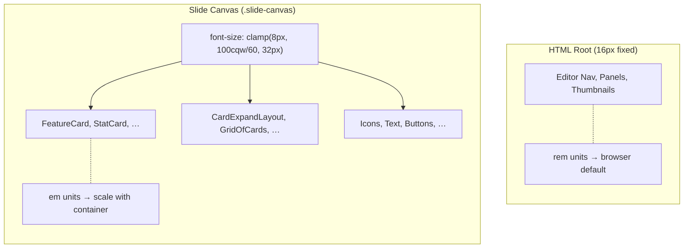

# Responsive Slide Sizing (Gamma-Style Scaling)

> How slide content scales proportionally across any viewport or container size.

---

## Problem

Slide presentations must look correct at many sizes: tiny editor thumbnails,
mid-size editor canvases, full-screen playback on a laptop, and 4K displays.
Fixed pixel values (`width: 200px`) produce content that is too large in
thumbnails and too small on 4K screens.

## Solution

All slide-internal content is sized in **`em` units** relative to a responsive
`font-size` set on the slide canvas container. The `font-size` scales linearly
with the container width, so every `em`-based dimension scales proportionally.

Non-slide UI (editor chrome, panels, navigation) uses the standard **`rem`**
units tied to the browser's root `font-size` (16 px default).

---

## Architecture



### How the `font-size` scales

The `.slide-canvas` class (defined in `slide-ui.css`) uses CSS container
queries to set a responsive font-size:

```css
.slide-canvas {
  container-type: inline-size;
  font-size: clamp(0.5rem, calc(100cqw / 60), 2rem);
}
```

| Container width | Computed font-size | 1 em = |
|:---------------:|:------------------:|:------:|
| 480 px          | 8 px (clamped min) | 8 px   |
| **960 px**      | **16 px (base)**   | 16 px  |
| 1920 px         | 32 px (clamped max)| 32 px  |
| 3840 px (4K)    | 32 px (clamped max)| 32 px  |

At the design-space base width of **960 px**, `font-size` = 16 px, so
**1 em = 16 design-space pixels**. All component dimensions were authored at
this base.

---

## Conversion Formula

```
em value = design-space pixels ÷ 16
```

### Common conversions

| Design px | em      | Usage examples |
|:---------:|:-------:|----------------|
| 4         | 0.25em  | Small gap      |
| 8         | 0.5em   | Standard gap   |
| 10        | 0.625em | Small text     |
| 12        | 0.75em  | Body text (xs) |
| 14        | 0.875em | Body text (sm) |
| 16        | 1em     | Base text      |
| 20        | 1.25em  | Large text     |
| 28        | 1.75em  | Icon box       |
| 40        | 2.5em   | Large icon box |
| 52        | 3.25em  | XL icon box    |
| 64        | 4em     | Hero icon box  |
| 120       | 7.5em   | Card min-width |
| 200       | 12.5em  | Large card     |

---

## The `em()` Helper

A TypeScript utility in `slide-ui/units.ts` converts design-space pixels to
`em` strings for inline styles:

```typescript
import { em } from '@/components/slide-ui/units';

// em(28) → '1.75em'
style={{ width: em(28), height: em(28) }}
```

For Tailwind classes, use arbitrary `em` values directly:

```tsx
className="p-[0.75em] gap-[0.5em] text-[0.875em] rounded-[0.75em]"
```

---

## Avoiding `em` Compounding

The `em` unit is relative to the element's **own** computed `font-size`. If a
container sets both `font-size` and uses `em` for dimensions, the dimensions
are relative to the container's (possibly different) font-size — not the slide
canvas's.

### Rule: `font-size` only on leaf text elements

```
✅ Good                              ❌ Bad
─────────────────────────            ─────────────────────────
.card {                              .card {
  padding: 0.75em;  /* → canvas fs */   font-size: 0.875em;
  gap: 0.5em;       /* → canvas fs */   padding: 0.75em;  /* → card's fs! */
}                                    }
.card__title {
  font-size: 0.875em; /* leaf text */
}
```

Container `<div>`s inherit `font-size` from the slide canvas and use `em` for
all dimensional properties (width, height, padding, gap, margin,
border-radius). Only leaf `<span>` / `<p>` / `<h*>` elements set `font-size`.

This is the existing pattern in all `slide-ui` components.

### Fallback for edge cases

For rare cases where both `font-size` and dimensional `em` are needed on the
same element, the `.slide-canvas` class also provides a CSS custom property:

```css
--su: calc(100cqw / 960);  /* 1 slide-unit = 1 design-space pixel */
```

Use `calc(var(--su) * 28)` instead of `1.75em` to avoid compounding.

---

## What Stays as Pixels

Not everything should scale with the container:

| Property | Unit | Reason |
|----------|------|--------|
| Border widths (1px, 1.5px, 2px) | `px` | Hairlines should stay crisp |
| `z-index` | unitless | Stacking order |
| `opacity` | unitless | Transparency |
| `scale` | unitless | CSS transform |
| Animation durations | seconds | Timing |
| `blur()` filter values | `px` | Absolute blur radius |
| `backdrop-blur` | `px` | Absolute blur radius |

---

## File Index

| File | Purpose |
|------|---------|
| `slide-ui/slide-ui.css` | `.slide-canvas` class with responsive `font-size` |
| `slide-ui/units.ts` | `em()` helper function, `SLIDE_BASE_PX` constant |
| `slide-ui/index.ts` | Re-exports `em` and `SLIDE_BASE_PX` |
| `animation/SlideFrame.tsx` | Play-mode container — applies `slide-canvas` class |
| `slide-editor/SlideMainCanvas.tsx` | Editor canvas — applies `slide-canvas` class |

---

## Non-Slide UI (rem)

Components **outside** the slide canvas (editor panels, navigation, thumbnails,
controls) use Tailwind's standard spacing/text classes which are `rem`-based.

Arbitrary pixel text classes in these components have been converted to `rem`:

```
text-[9px]  → text-[0.5625rem]
text-[10px] → text-[0.625rem]
text-[11px] → text-[0.6875rem]
```

Standard Tailwind classes (`text-sm`, `p-3`, `gap-2`) are already `rem`-based
and require no changes.
