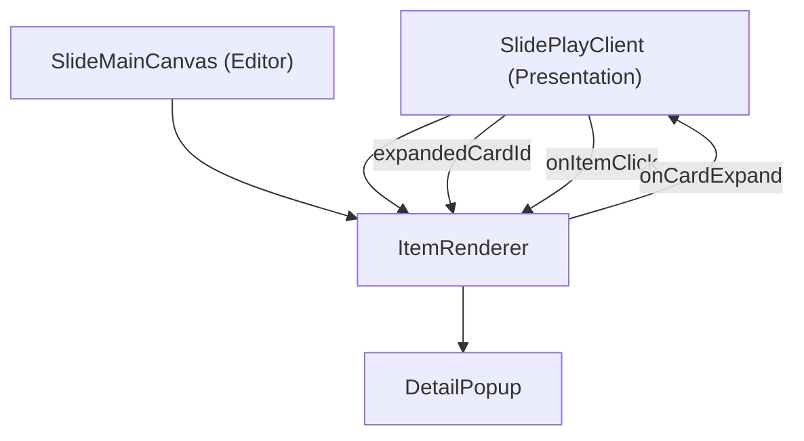
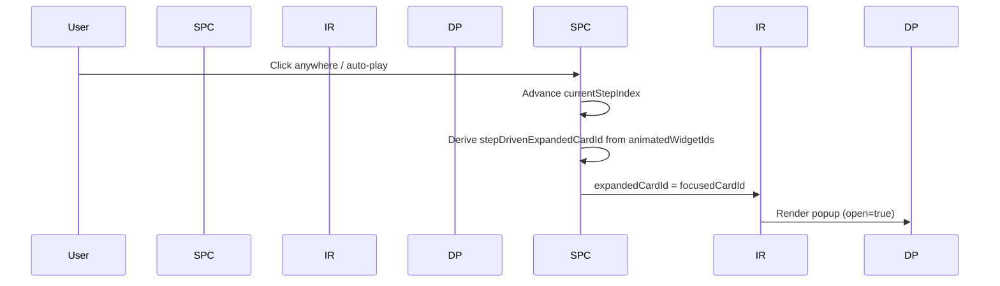
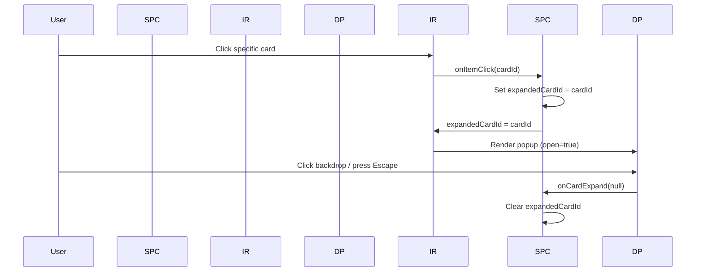
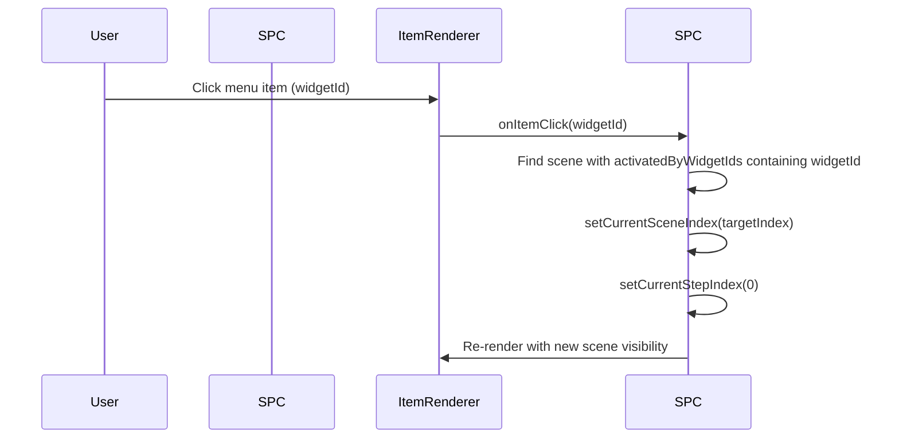

# Smart Cards and Menu/Tab Layouts

Technical documentation for the interactive card popup and menu/tab navigation patterns used in VisualFlow slides.

## Overview

VisualFlow supports two interactive content patterns beyond standard animation:

1. **Popup Callout** -- A card shows additional detail content as an overlay popup, without changing the underlying slide layout.
2. **Menu/Tab Navigation** -- Sidebar or tab items act as navigation controls, switching between sub-slides (Scenes) when clicked.

Both patterns build on the existing data model (`Slide`, `Scene`, `SlideItem`) with two extensions:
- `CardItem.detailItems` -- detail content for popup overlays
- `Scene.activatedByWidgetIds` -- widget-to-scene mapping for navigation

---

## Data Model Extensions

### `CardItem.detailItems`

**File:** `apps/web/src/types/slide.ts`

```typescript
export interface CardItem extends SlideItemBase {
  type: 'card';
  children: SlideItem[];
  /**
   * Optional detail content shown in a popup overlay when the card is
   * expanded (via click or step-driven focus).
   */
  detailItems?: SlideItem[];
}
```

When a card has `detailItems`, it is treated as an expandable card. The detail content is rendered inside a `DetailPopup` component when the card is focused (step-driven) or clicked (click-only).

### `Scene.activatedByWidgetIds`

**File:** `apps/web/src/types/scene.ts`

```typescript
export interface Scene {
  // ... existing fields
  /**
   * Widget IDs that activate this scene when clicked in presentation mode.
   * Enables non-linear navigation within a slide.
   */
  activatedByWidgetIds?: string[];
}
```

When a scene has `activatedByWidgetIds`, clicking any of the listed widget IDs causes the player to jump directly to that scene. This enables sidebar menu items and tab buttons to function as navigation controls.

---

## Architecture

### Component Hierarchy



### ItemRenderer Props for Popup Support

```typescript
export interface ItemRendererProps {
  items: SlideItem[];
  getVisibility?: (itemId: string) => ItemVisibility;
  onItemClick?: (itemId: string) => void;
  expandedCardId?: string | null;       // ID of card showing its popup
  onCardExpand?: (cardId: string | null) => void;  // open/close callback
}
```

When `expandedCardId` matches a card that has `detailItems`, `ItemRenderer` renders a `DetailPopup` overlay within the slide canvas. The popup header (icon, title, description) is automatically extracted from the card's `children`.

---

## Popup Callout Pattern

### Mode A: Step-Driven Popup

Each animation step focuses a card. The focused card's `DetailPopup` is automatically shown.



**Configuration:**
- Scene `enterBehavior.revealMode`: `'sequential'`
- Scene `enterBehavior.includeOverviewStep`: `true`
- `interactionBehaviors`: `[{ trigger: 'click', action: 'toggle-expand', availableInAutoMode: true }]`

### Mode B: Click-Only Popup

All cards are visible at once. Clicking a specific card opens its popup. Clicking the slide background advances the slide normally.



**Configuration:**
- Scene `enterBehavior.revealMode`: `'all-at-once'`
- `interactionBehaviors`: `[{ trigger: 'click', action: 'toggle-expand', availableInAutoMode: false }]`

### Popup Animation: Grow From Card

The `DetailPopup` supports a `originRect` prop that specifies the card's position relative to the slide canvas. When provided, the popup animates from `scale(0.4)` at the card's center to `scale(1)` at the canvas center.

`ItemRenderer` computes `originRect` by:
1. Finding the card DOM element via `[data-item-id]` attribute
2. Computing its bounding rect relative to the `rootRef` container
3. Passing the rect to `DetailPopup.originRect`

The popup uses `transformOrigin` derived from the card center to create a natural grow-from-card effect.

### Popup Background

The popup uses a near-solid dark background (`color-mix(in srgb, accentColor 8%, #0f172a 92%)`) for readability, replacing the previous semi-transparent `backdrop-blur` approach.

---

## Menu/Tab Navigation Pattern

### How It Works

Each menu item or tab corresponds to a `Scene`. When the user clicks a menu item, the system:

1. Checks `handleItemClick` in `SlidePlayClient` / `SlideMainCanvas`
2. Searches all scenes for one whose `activatedByWidgetIds` includes the clicked widget ID
3. If found, switches to that scene (non-linear jump), resetting `currentStepIndex` to 0
4. The scene's `initialStates` control which content panel is visible



### Sidebar Menu Slide Structure

```
Slide
  items:
    Layout (sidebar)
      Layout (stack) -- menu items (always visible)
        Card "menu-item-A"
        Card "menu-item-B"
        Card "menu-item-C"
      Card "detail-panel-A"  -- visible in Scene 0
      Card "detail-panel-B"  -- visible in Scene 1
      Card "detail-panel-C"  -- visible in Scene 2

  scenes:
    Scene 0: { activatedByWidgetIds: ["menu-item-A"], initialStates: [A=visible, B=hidden, C=hidden] }
    Scene 1: { activatedByWidgetIds: ["menu-item-B"], initialStates: [A=hidden, B=visible, C=hidden] }
    Scene 2: { activatedByWidgetIds: ["menu-item-C"], initialStates: [A=hidden, B=hidden, C=visible] }
```

### Tab Navigation Slide Structure

Same concept as sidebar, but with a horizontal tab bar:

```
Slide
  items:
    Layout (stack, vertical)
      Layout (flex, horizontal) -- tab bar
        Card "tab-A"
        Card "tab-B"
        Card "tab-C"
      Card "panel-A"  -- visible in Scene 0
      Card "panel-B"  -- visible in Scene 1
      Card "panel-C"  -- visible in Scene 2

  scenes:
    Scene 0: { activatedByWidgetIds: ["tab-A"], ... }
    Scene 1: { activatedByWidgetIds: ["tab-B"], ... }
    Scene 2: { activatedByWidgetIds: ["tab-C"], ... }
```

### AnimationStepStrip Labeling

When a slide has scenes with `activatedByWidgetIds`, the `AnimationStepStrip` header label changes from "Steps" to "Sub-slides" to communicate that each scene represents a navigable content panel, not just an animation step.

---

## Key Files

| File | Role |
|------|------|
| `types/slide.ts` | `CardItem.detailItems` definition |
| `types/scene.ts` | `Scene.activatedByWidgetIds` definition |
| `components/animation/ItemRenderer.tsx` | Renders items tree; handles `expandedCardId` and `DetailPopup` overlay |
| `components/slide-ui/molecules/DetailPopup.tsx` | Popup overlay with grow-from-card animation and solid background |
| `components/slide-play/SlidePlayClient.tsx` | Presentation mode: popup state, menu/tab click-to-navigate |
| `components/slide-editor/SlideMainCanvas.tsx` | Editor mode: same popup + navigation logic |
| `components/slide-editor/AnimationStepStrip.tsx` | Shows "Sub-slides" label for menu/tab slides |
| `config/demo-slides.ts` | Demo slides with popup callout, sidebar menu, and tab navigation |

---

## Adding New Interactive Patterns

### Adding a New Popup Card

1. Create a `CardItem` with `detailItems` in the slide's items tree
2. Add the card's ID to the scene's `animatedWidgetIds`
3. Set appropriate `interactionBehaviors` (step-driven or click-only)

### Adding a New Menu Style

1. Create the menu items as `CardItem` children in the items tree
2. Create one `Scene` per menu item with `activatedByWidgetIds` pointing to the menu item's ID
3. Each scene's `initialStates` controls which content panel is visible
4. The menu items themselves are always visible (not in `animatedWidgetIds`, or set to `visible: true` in all scenes)

### Future: Visual Variants for Menu Items

Menu items can be styled differently without architectural changes:
- Process flow (horizontal nodes with connecting lines)
- Icon-only (compact sidebar)
- Collapsible icon+text (like web app side menus)

These are purely visual variants of the menu `CardItem` children and can be implemented as new molecule components.
